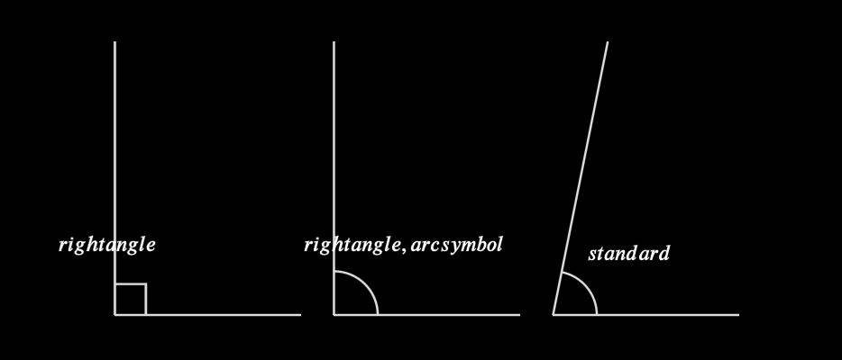
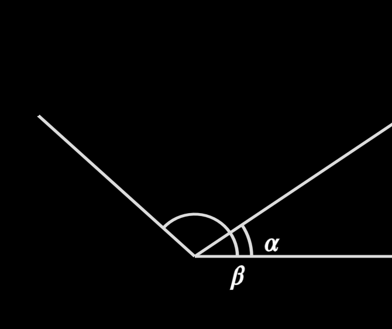
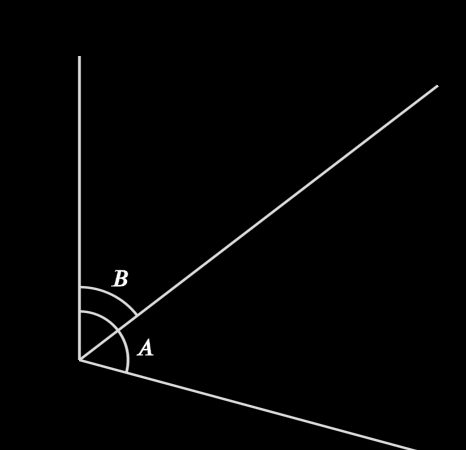

# EAngle 

`EAngle` creates either an arc, or a box (if angle is a right angle), that is used to denote the angle between two lines. 

> Calling this function (it is not a class) will return objects of type `Gnomon| ArcAngle| RightAngle` which are all dervied classes from `EangleBase`

[base methods and properties](./base_object_documentation.md)

## Arguments

| variable             | type                     | default        | description                                                  |
| -------------------- | ------------------------ | -------------- | ------------------------------------------------------------ |
| `l1`                 | `ELine`                  |                | one of the two lines denoting the angle                      |
| `l2`                 | `ELine`                  |                | the second of the two lines denoting the angle (the two lines ***must*** have a common vertex!) |
| `size`               | `float`                  | `ANGLE_SIZE` | The radius of the arc which indicates the angle              |
| `no_right`           | `bool`                   | `False`        | If set to True, the angle will be indicated by an arc, even if the angle is 90 degrees |
| `gnomon`             | `bool`                   | `False`        | Is  or is not an angle describing an gnomon (the part of a parallelogram left when a similar parallelogram has been taken from its corner) |
| `stroke_width` | `float` | 2        | the width of the line outlining the object |
| `label`/`label_args` | `str`, `tuple[str,dict]` | `None`         | Instead of using the method `add_label`, you can add a label here |
| `**kwargs`           |                          |         | Extra arguments for the animation                            |

_Example_:


```python
    l1 = ELine(mn_coord(130,400),mn_coord(130,150))
    l2 = ELine(mn_coord(130,400),mn_coord(300,400))
    EAngle(l1,l2,label=("right angle",dict(buff=2*LABEL_BUFF)))

    l1 = ELine(mn_coord(330,400),mn_coord(330,150))
    l2 = ELine(mn_coord(330,400),mn_coord(500,400))
    EAngle(l1,l2, no_right=True, label=("right angle, arc symbol",dict(buff=2*LABEL_BUFF)))

    l1 = ELine(mn_coord(530,400),mn_coord(580,150))
    l2 = ELine(mn_coord(530,400),mn_coord(700,400))
    EAngle(l1,l2, label=("standard",dict(buff=2*LABEL_BUFF)))
```

## Properties

| Property        | type                 | Description                                                  |
| --------------- | -------------------- | ------------------------------------------------------------ |
| `lines`         | `tuple[ELine,ELine]` | the two lines that define the angle                          |
| `center`        | `mn.Vect3`           | the coordinates of the vertex of the two lines defining the angle |
| `e_start_angle` | `float` (radians)    | the angle (in radians) where the angle starts (i.e. the smaller of the two angles defined by the two lines) |
| `e_angle`       | `float` (radians)    | the total angle (in radians)                                 |
| `radius`        | `float`              | the radius of the arc indicating the angle                   |


## Label

```python
# valid ways of adding a label
EAngle(line1, line2, label='A')
EAngle(line1, line2, label=('A',dict(alpha=0.25)))

a = EAngle(line1, line2)
a.add_label('A', alpha=0.25)
```

### `add_label(text, where, alpha, buff, align)->EAngle`

| parameter | type               | default                     | description                                                  |
| --------- | ------------------ | --------------------------- | ------------------------------------------------------------ |
| `text`    | `str`              |                             | the label text                                               |
| `where`   | `ArcLabelLocation` | `ArcLabelLocation.BY_ALPHA` | `BY_ALPHA` - label is placed a fraction along its arc (defined by `alpha` argument)<br>`AT_START` - label is placed at the beginning of the arc (`alpha` argument is ignored)<br>`AT_END` - label is placed at the end of the arc (`alpha` argument is ignored) |
| `alpha`   | `float`            | `0.5`                       | a fractional value defining where along the arc path the label should be placed |
| `buff`    | `float`            | `LABEL_BUFF`                | the amount of space between the arc and the label            |
| `align`        |      | `mn.ORIGIN`| which side to align the text to |


_Example_:


```python
    l1 = ELine(mn_coord(130,400),mn_coord(500,150))
    l2 = ELine(mn_coord(130,400),mn_coord(500,400))
    l3 = ELine(mn_coord(130,400),mn_coord(20,300))
    
    # add label after the fact
    a = EAngle(l2,l1)
    a.add_label(r'\alpha', alpha = 0.25)
    
    ## SAME THING AS ABOVE
    # e = EAngle(l2,l1, label=(r'\alpha`,dict(alpha=0.25)))
    
    # add label as part of the creation of the angle
    b = EAngle(l2,l3, size=mn_scale(30), label_args=(r'\beta', dict(where=ArcLabelLocation.AT_START)))
    
```


## Transformations

Note that the transformations only apply to the angle indicator and its label, not to the two lines that define the angle.

> See the transformations documentation for details.

Generally speaking, it is not necessary to transform an angle using a transformation methods.  


## Constructions

### `copy_to_line(point, line, negative, speed)-> tuple[ELine, EAngleBase]`

Takes an existing angle, and copies that angle onto another line.  

> Note: angle is calculated from `line` to the new calculated line, so <font color='red'>`___`</font>`/` would be a positive angle if <font color='red'>`___`</font> was the original line

| parameter  | type     | default | description                                                  |
| ---------- | -------- | ------- | ------------------------------------------------------------ |
| `point`    | `EPoint` |         | the point that will define the vertex of the angle           |
| `line`     | `ELine`  |         | the line to which the new angle will be drawn on             |
| `negative` | `bool`   | `False` | if true, a positive angle will be drawn, else a negative angle |
| `speed`    | `int`    | `None`  | if  `speed > 0`, the construction of the new angle will be animated, otherwise only the final angle being drawn will be animated.  The larger the `speed` number, the faster the animation |

_Example:_ Copy to line, no construction animation (click to play)
<video controls width="300" height="200" poster="placeholder_image.png">
    <source src="./images/angle_copy_to_line_speed_0.mp4" type="video/mp4">
</video>
```python
    l1 = ELine(mn_coord(100,400),mn_coord(500,150))
    l2 = ELine(mn_coord(100,400),mn_coord(500,500))
    a = EAngle(l2,l1,label="A")
    l3 = ELine(mn_coord(100,600),mn_coord(500,600))
    new_line, new_angle = a.copy_to_line(EPoint(mn_coord(100,600)),l3)
```

_Example:_ Copy to line, with construction animation (click to play)
<video controls width="300" height="200" poster="placeholder_image.png">
    <source src="./images/angle_copy_to_line_speed_1.mp4" type="video/mp4">
</video>

```python
    l1 = ELine(mn_coord(130,400),mn_coord(500,150))
    l2 = ELine(mn_coord(130,400),mn_coord(500,400))
    a = EAngle(l2,l1,label="A")
    l3 = ELine(mn_coord(100,600),mn_coord(500,600))
    new_line, new_angle = a.copy_to_line(EPoint(mn_coord(100,600)),l3,speed=1)

```

### `bisect(speed) -> ELine, EPoint`

Create a line that bisects the angle, and draws said line

| parameter | type | default | description |
| --------- | ---- | ------- | ----------- |
| `speed`    | `int`    | `None`  | if  `speed > 0`, the construction of the new angle will be animated, otherwise only the final |


_Example:_


```python
    l1 = ELine(mn_coord(130,400),mn_coord(130,150))
    l2 = ELine(mn_coord(130,400),mn_coord(500,500))
    a = EAngle(l2,l1,label=("A",dict(alpha=.25)))
    l3,p = a.bisect()
    p.e_remove()
    a_half = EAngle(l1,l3, label="B", size=mn_scale(60))
```


