# EArc 

`EArc` is a portion of a circle 

> [base methods and properties](./base_object_documentation.md)


## Arguments

| variable             | type                     | default | description                                                  |
| -------------------- | ------------------------ | ------- | ------------------------------------------------------------ |
| `radius`             | `float`                  |         | radius of the arc                                            |
| `point1`             | `EPoint`, `mn.Vect3`     |         | the start point of the arc (Note: the arc will always be constructed anti-clockwise ) |
| `point2`             | `EPoint`, `mn.Vect3`     |         | the end point of the arc (Note: the arc will always be constructed anti-clockwise ) |
| `big`        | `bool`                   | `False` | There are two possible arcs, if `True` choose the biggest |
| `label`/`label_args` | `str`, `tuple[str,dict]` | `None`         | Instead of using the method `add_label`, you can add a label here |
| `**kwargs`           |                          |         | Extra arguments for the animation                            |

_Example:_ default
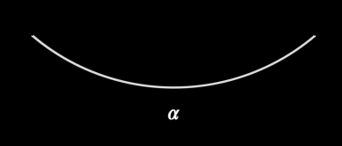

```python
    EArc(mn_scale(200), mn_coord(40,400), mn_coord(300,400), label=r"\alpha")
```

_Example:_ direction matters
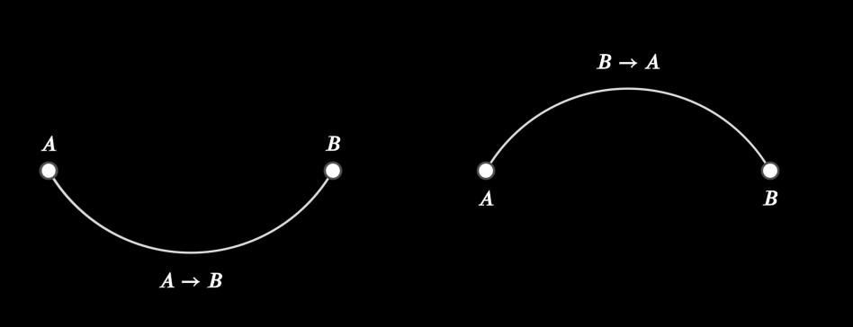

```python
    A = EPoint(mn_coord(40,400),label="A")
    B = EPoint(mn_coord(300,400),label="B")
    EArc(mn_scale(150), A, B, label=r"A\rightarrow B")

    A = EPoint(mn_coord(440,400),label=("A",dict(direction=mn.DOWN)))
    B = EPoint(mn_coord(700,400),label=("B",dict(direction=mn.DOWN)))
    EArc(mn_scale(150), B, A, label=r"B\rightarrow A")
```

_Example:_ Big vs Small
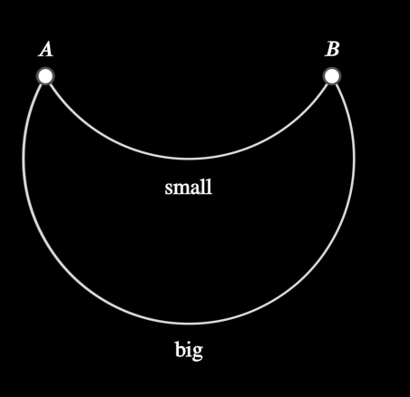

```python
    A = EPoint(mn_coord(40,400),label="A")
    B = EPoint(mn_coord(300,400),label="B")
    EArc(mn_scale(150),A,B, label=r"\text{small}")
    EArc(mn_scale(150),A,B, big=True, label=r"\text{big}")
```

## EArc.semi_circle

CLASS method


### Arguments

| variable             | type                     | default | description                                                  |
| -------------------- | ------------------------ | ------- | ------------------------------------------------------------ |
| `point1`             | `EPoint`, `mn.Vect3`     |         | the start point of the arc (Note: the arc will always be constructed anti-clockwise ) |
| `point2`             | `EPoint`, `mn.Vect3`     |         | the end point of the arc (Note: the arc will always be constructed anti-clockwise ) |
| `label`/`label_args` | `str`, `tuple[str,dict]` | `None`  | Instead of using the method `add_label`, you can add a label here |
| `**kwargs`           |                          |         | Extra arguments for the animation                            |

**Returns:** Arc object


_Example_: Semi circle
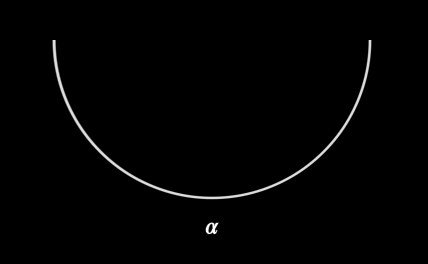

```python
    a = EArc.semi_circle(mn_coord(40,400),mn_coord(300,400), label=r"\alpha")
```


## EArc Properties

| Property        | type              | Description                                                  |
| --------------- | ----------------- | ------------------------------------------------------------ |
| `point1_coord`  | `mn.Vect3`        | Coordinates of the start of the arc                          |
| `point2_coord`  | `mn.Vect3`        | Coordinates of the end of the arc                            |
| `center`        | `mn.Vect3`        | the coordinates of the vertex of the two lines defining the angle |
| `e_start_angle` | `float` (radians) | the angle (in radians) where the angle starts (i.e. the smaller of the two angles defined by the two lines) |
| `arc`           | `float` (radians) | the total angle or the arc (in radians)                      |
| `radius`        | `float`           | the radius of the arc                                        |
|                 |                   |                                                              |


## Label

```python
# valid ways of adding a label
EArc(line1, line2, label='A')
EArc(line1, line2, label=('A',dict(alpha=0.25)))

a = EArc(line1, line2)
a.add_label('A', alpha=0.25)
```

### `add_label(text, where, alpha, buff)->EArc`

    | parameter | type               | default                     | description                                                  |
    | --------- | ------------------ | --------------------------- | ------------------------------------------------------------ |
    | `text`    | `str`              |                             | the label text                                               |
    | `where`   | `ArcLabelLocation` | `ArcLabelLocation.BY_ALPHA` | `BY_ALPHA` - label is placed a fraction along its arc (defined by `alpha` argument)<br>`AT_START` - label is placed at the beginning of the arc (`alpha` argument is ignored)<br>`AT_END` - label is placed at the end of the arc (`alpha` argument is ignored) |
    | `alpha`   | `float`            | `0.5`                       | a fractional value defining where along the arc path the label should be placed |
    | `buff`    | `float`            | `LABEL_BUFF`                | the amount of space between the arc and the label            |

**Returns:** Arc object


_Example_:
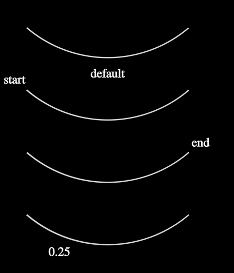

```python
    e = EArc(mn_scale(200),mn_coord(40,400),mn_coord(300,400))
    e.add_label(r'\text{default}')

    e = EArc(mn_scale(200),mn_coord(40,500),mn_coord(300,500))
    e.add_label(r'\text{start}',where=ArcLabelLocation.AT_START)

    e = EArc(mn_scale(200),mn_coord(40,600),mn_coord(300,600))
    e.add_label(r'\text{end}',where=ArcLabelLocation.AT_END)

    e = EArc(mn_scale(200),mn_coord(40,700),mn_coord(300,700))
    e.add_label(r'0.25',alpha=0.25)

```


## Methods

### `bisect(self)->EPoint`

Draws a point on the arc at the specified angle.  If this point is not located on the arc, then it will draw a point on the closest of the end or start of the arc.

| parameter | type    | default | description                                     |
| --------- | ------- | ------- | ----------------------------------------------- |
| `angle`   | `float` | 0.5     | the absolute angle to draw the point on the arc |

_Example:_ bisect
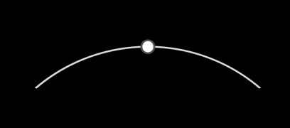

```python
    a = EArc(mn_scale(200), mn_coord(300, 400), mn_coord(40, 400))
    p = a.bisect()
```

### `create_pie(self, **kwargs)->EMObject`

Adds (or removes) a wedge to (from) the arc, to make a pie shaped object

| parameter | type               | default                     | description                                                |
| --------- | ------------------ | --------------------------- | -----------------------------------------------------------|
| `**kwargs`           |                          |         | Extra arguments for the animation                            |

**Returns:** EMObject

_Example:_ Pie
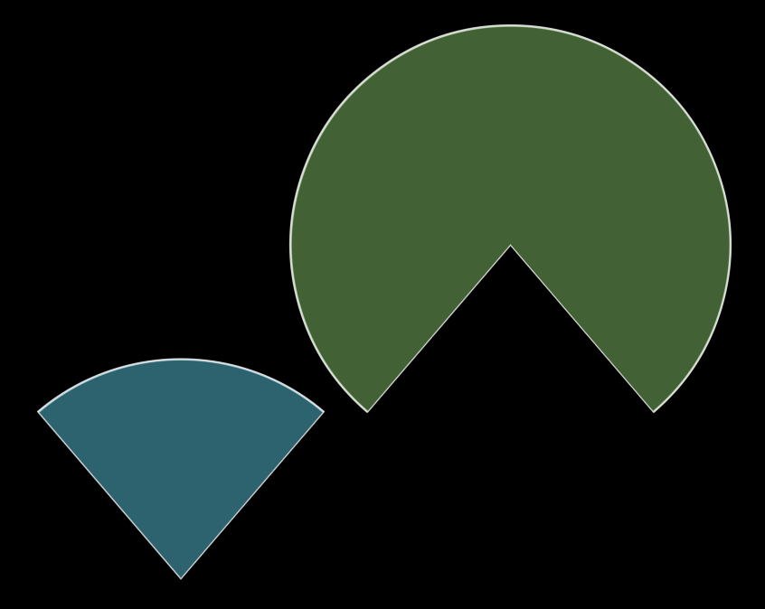

```python
    a = EArc(mn_scale(200),mn_coord(300,400),mn_coord(40,400))
    a_pie = a.create_pie()
    a_pie.e_fill(mn.BLUE)
    b = EArc(mn_scale(200),mn_coord(600,400),mn_coord(340,400), big=True)
    b_pie = b.create_pie()
    b_pie.e_fill(mn.GREEN)
```

### ` e_point_at_angle(self, angle)->EPoint`

Draws a point on the arc at the specified angle.  If this point is not located on the arc, then it will draw a point on the closest of the end or start of the arc.

| parameter | type    | default | description                                     |
| --------- | ------- | ------- | ----------------------------------------------- |
| `angle`   | `float` | 0.5     | the absolute angle to draw the point on the arc |

_Example:_ points on arc at various angles positions
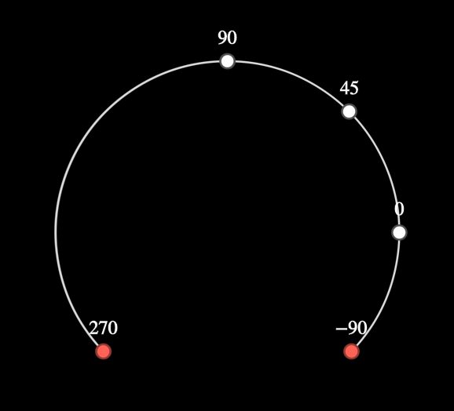


```python
    a = EArc(mn_scale(180),mn_coord(400,400),mn_coord(140,400), big=True)
    p1 = a.e_point_at_angle(0).add_label(r"0")
    p2 = a.e_point_at_angle(mn.PI/4).add_label(r"45")
    p3 = a.e_point_at_angle(mn.PI/2).add_label(r"90")
    p4 = a.e_point_at_angle(3*mn.PI/2).add_label(r"270").red()
    p5 = a.e_point_at_angle(-mn.PI/2).add_label(r"-90").red()
```

### `intersect(self, other: mn.Mobject, reverse=True) -> list[mn.Vect3]`

Finds the intersection coordinates of this arc and the other object

| parameter | type                       | default | description |
| --------- | -------------------------- | ------- | ----------- |
| `other`   | `Eline`, `EArc`, `ECircle` |         |             |
| `reverse` | `bool`                     | `True`  | not used    |

_Example:_ Intersect lines
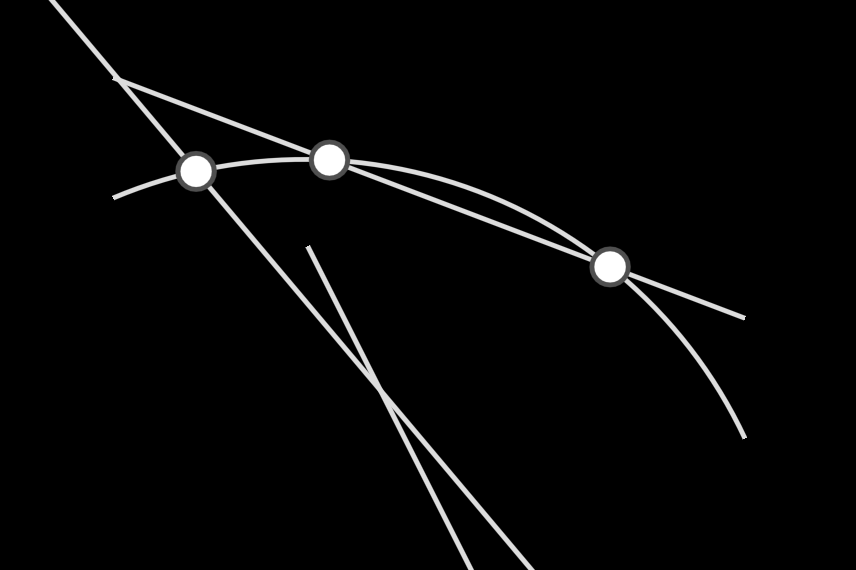

```python
    a = EArc(mn_scale(200), mn_coord(600, 500), mn_coord(340, 400))

    # intersects one point
    l = ELine(mn_coord(800,900),mn_coord(300,300))
    intersections = a.intersect(l)
    for i in intersections:
        EPoint(i)

    # line not long enough
    l = ELine(mn_coord(520,620),mn_coord(420,420))
    intersections = a.intersect(l)
    for i in intersections:
        EPoint(i)

    # two points
    l = ELine(mn_coord(600,450),mn_coord(340,350))
    intersections = a.intersect(l)
    for i in intersections:
        EPoint(i)

```

_Example:_ Intersect arc
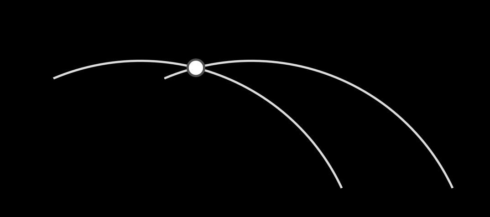

```python
    a1 = EArc(mn_scale(200), mn_coord(600, 500), mn_coord(340, 400))
    a2 = EArc(mn_scale(200), mn_coord(700, 500), mn_coord(440, 400))
    pts=a1.intersect(a2)
    for i in pts:
        EPoint(i)
```


### `point_at_angle(self, angle) -> mn.Vect3`

return the coordinates on the arc at a given angle


### `tangent_at_start(self) -> mn.Vect3:` 

calculates the directional vector describing the tangent at the start of the arc


### `tangent_at_end(self)-> mn.Vect3:`

calculates the directional vector describing the tangent at the start of the arc


### `tangent_points(self, angle_or_point, negative=False) -> tuple[mn.Vect3, mn.Vect3]`

returns **two** coordinates which define a tangent line. 
| parameter | type               | default                     | description                                                |
| --------- | ------------------ | --------------------------- | -----------------------------------------------------------|
| `angle_or_point` | `float`, `mn.Mobject`, `mn.Vect3` |         | Either an angle (float) or a Point or coordinate on the arc!! (otherwise weird stuff happens) |
| `negative` | `bool` | `False` | which way the angle vector is rotated to determine the tangent |

_Example_: tangents
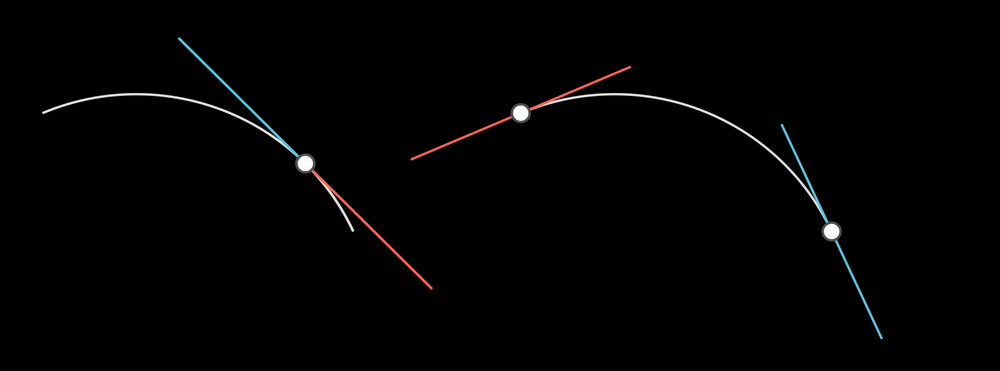

```python
    # Create the arc, and get a point on the arc
    a = EArc(mn_scale(200), mn_coord(300, 500), mn_coord(40, 400))
    p1 = a.e_point_at_angle(mn.PI/4)

    # Calculate tangent line for this point (both positive and negative directions)
    tangents_pos = a.tangent_points(p1)
    tangents_neg = a.tangent_points(p1, negative=True)
    ELine(*tangents_pos).extend(mn_scale(50)).blue()
    ELine(*tangents_neg).extend(mn_scale(50)).red()

    # Create the arc, make points for the start and finish location of the arc
    a = EArc(mn_scale(200), mn_coord(700, 500), mn_coord(440, 400))
    EPoint(a.point1_coord)
    EPoint(a.point2_coord)

    # calculate the direction vector for the tangent, and construct a tangent line 
    #    notice how this is different than above code, since it only returns one mn.Vect3 object, not two
    direction = a.tangent_at_start()
    ELine(a.point1_coord+mn_scale(100)*direction, a.point1_coord-mn_scale(100)*direction).blue()

    direction = a.tangent_at_end()
    ELine(a.point2_coord+mn_scale(100)*direction, a.point2_coord-mn_scale(100)*direction).red()

```


