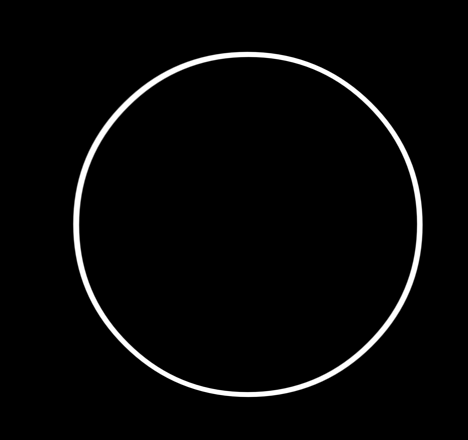
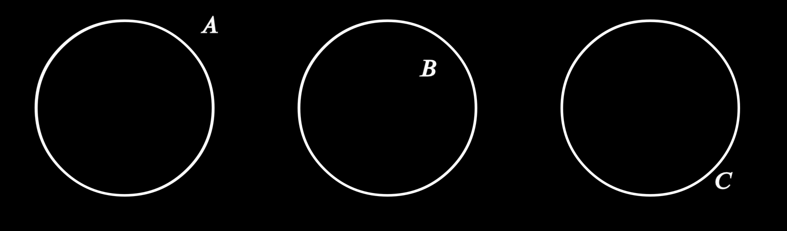
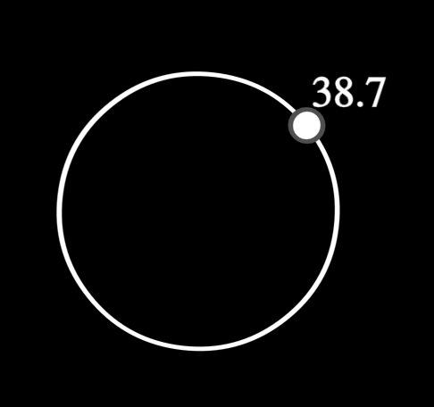
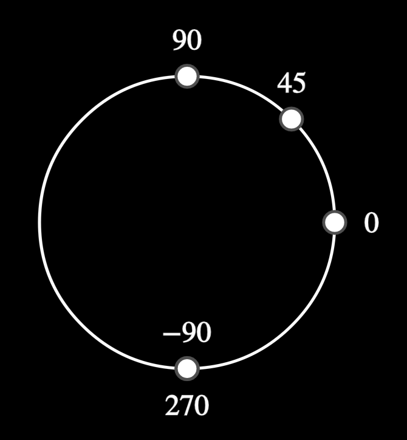
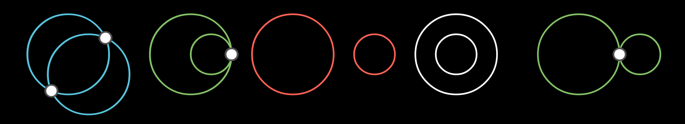
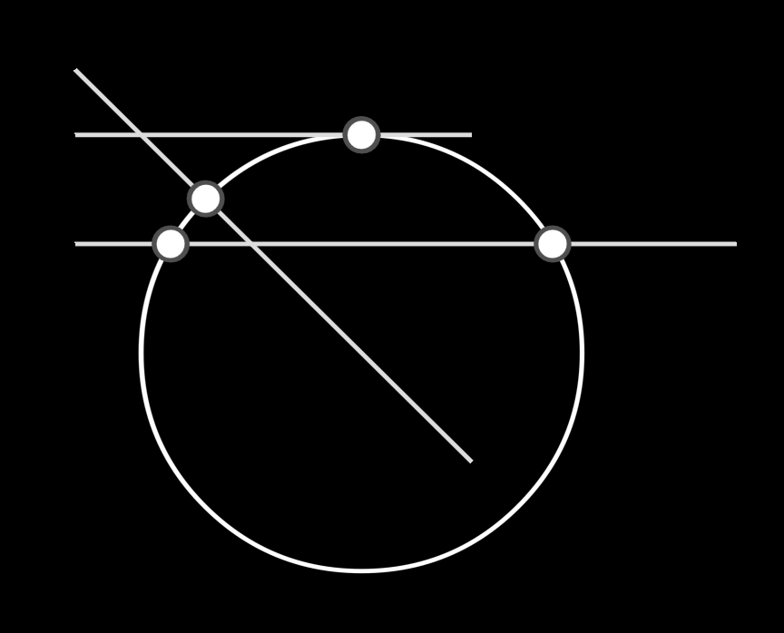
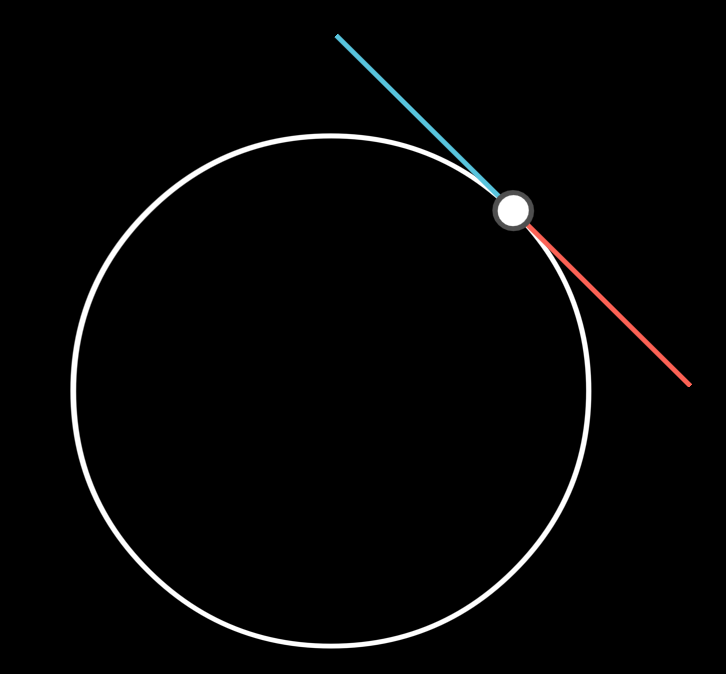
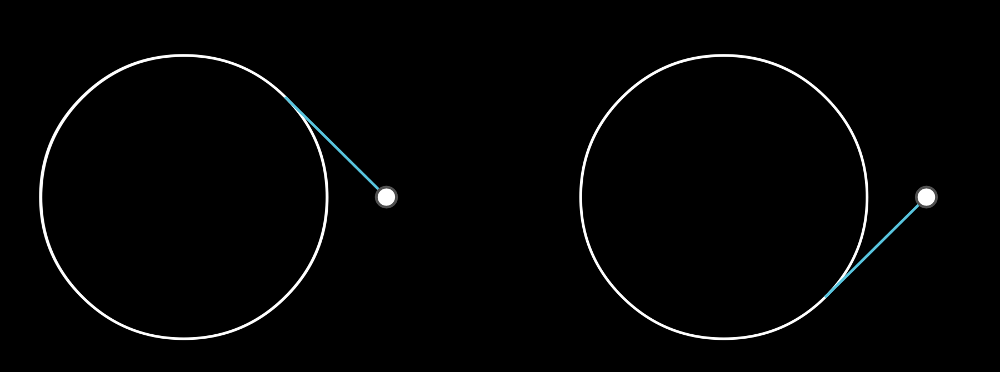

# ECircle

> [base methods and properties](./base_object_documentation.md)


## Arguments

| variable             | type                     | default | description                                                  |
| -------------------- | ------------------------ | ------- | ------------------------------------------------------------ |
| `center`             | `Point.EPoint, mn.Vect3` |         | the center point of the circle (coordinates or EPoint object) |
| `point1`             | `EPoint`, `mn.Vect3`     |         | any point on the circle (coordinate or EPoint object)        |
| `temp_line_label`    | `str`                    | ""      | a label for the line that is used during the animation of the circle drawing |
| `stroke_width` | `float` | 2        | the width of the line outlining the object |
| `label`/`label_args` | `str`, `tuple[str,dict]` | `None`         | Instead of using the method `add_label`, you can add a label here |
| `**kwargs`           |                          |         | Extra arguments for the animation                            |

_Example:_ default


```python
    c = ECircle(mn_coord(100, 100), mn_coord(150,150))
```

## ECircle Properties

| Property        | type              | Description                                                  |
| --------------- | ----------------- | ------------------------------------------------------------ |
| `center`        | `mn.Vect3`        | the coordinates of the vertex of the two lines defining the angle |
| `e_start_angle` | `float` (radians) | the angle (in radians) where the angle starts (i.e. the smaller of the two angles defined by the two lines) |
| `radius`        | `float`           | the radius of the arc                                        |


## Label

### `add_label(text, angle, outside, buff, align) -> ECircle`

| parameter | type    | default                | description                                             |
| --------- | ------- | ---------------------- | ------------------------------------------------------- |
| `text`    | `str`   |                        | the label text                                          |
| `angle`   | `float` | `mn.PI/4` (45 degrees) | Angle at which to place the label (in radians)          |
| `outside` | `bool`  | `True`                 | place label outside of circle if true, otherwise inside |
| `buff`    | `float` | `LABEL_BUFF`           | the amount of space between the circle and the label    |
| `align`        |      | `mn.ORIGIN`| which side to align the text to |


_Example:_


```python
    c1 = ECircle(mn_coord(100, 100), mn_coord(150,150), label='A')
    c2 = ECircle(mn_coord(310, 100), mn_coord(360,150)).add_label('B',outside=False)
    c3 = ECircle(mn_coord(520, 100), mn_coord(570,150), label=('C',dict(angle=-45, buff = 0.5*LABEL_BUFF)))
```

## Methods

### `angle_of_point(self, point) -> float`

Calculates the angle of a point (should be on the circle, but doesn't need to be).  Angle is of the line from the centre of the circle to the point

| parameter | type                 | default | description                                                  |
| --------- | -------------------- | ------- | ------------------------------------------------------------ |
| `point`   | `EPoint`, `mn.Vect3` |         | calculates and returns the value of the angle (in radians) of the point on the circle |

_Example:_ Label starting point with its angle


```python
    p = EPoint(mn_coord(150,110))
    c = ECircle(mn_coord(100, 150), p)
    angle = c.angle_of_point(p)
    c.add_label(f"{angle/DEGREES:.1f}", angle)
```


### ` e_point_at_angle(self, angle)->EPoint`

Draws a point on the circle at the specified angle.

| parameter | type    | default | description                                                  |
| --------- | ------- | ------- | ------------------------------------------------------------ |
| `angle`   | `float` |         | the absolute angle to draw the point (in radians) on the arc |

_Example:_ points on circle at various angle positions



```python
    c = ECircle(mn_coord(500,400),mn_coord(400,400))
    p1 = c.e_point_at_angle(0).add_label(r"0", direction=mn.RIGHT)
    p2 = c.e_point_at_angle(mn.PI/4).add_label(r"45")
    p3 = c.e_point_at_angle(mn.PI/2).add_label(r"90")
    p4 = c.e_point_at_angle(3*mn.PI/2).add_label(r"270", direction=mn.DOWN)
    p4 = c.e_point_at_angle(-mn.PI/2).add_label(r"-90", direction=mn.UP)
```


### `intersect(self, other, reverse) -> list[mn.Vect3]`

Finds the intersection coordinates of this arc and the other object. 

> NOTE: won't work properly with `EArc`, so invert comparison (`EArc->intersect(ECircle)` )

| parameter | type                | default | description |
| --------- | ------------------- | ------- | ----------- |
| `other`   | `Eline`,  `ECircle` |         |             |
| `reverse` | `bool`              | `True`  | not used    |

_Example:_ Intersect circles


```python
	# intersect at two points
	c1 = ECircle(mn_coord(200,200),mn_coord(250,200)).blue()
    c2 = ECircle(mn_coord(225,225),mn_coord(275,225)).blue()
    pts=c1.intersect(c2)
    for i in pts:
        EPoint(i)

    # two circles just touch
    c3 = ECircle(mn_coord(350,200),mn_coord(400,200)).green()
    c4 = ECircle(mn_coord(375,200),mn_coord(400,200)).green()
    pts=c3.intersect(c4)
    for i in pts:
        EPoint(i)

    # one circle outside another
    c5 = ECircle(mn_coord(475,200),mn_coord(525,200)).red()
    c6 = ECircle(mn_coord(575,200),mn_coord(600,200)).red()
    pts=c5.intersect(c6)
    for i in pts:
        EPoint(i)

    # one circle inside another
    c6 = ECircle(mn_coord(675,200),mn_coord(725,200))
    c7 = ECircle(mn_coord(675,200),mn_coord(700,200))
    pts=c6.intersect(c7)
    for i in pts:
        EPoint(i)

    # two circles just touch
    c8 = ECircle(mn_coord(825, 200), mn_coord(875, 200)).green()
    c9 = ECircle(mn_coord(900, 200), mn_coord(875, 200)).green()
    pts = c8.intersect(c9)
    for i in pts:
        EPoint(i)

```

_Example:_ Intersect Lines


```python
    c1 = ECircle(mn_coord(250,250),mn_coord(350,250))

    # intersects twice
    l = ELine(mn_coord(120,200),mn_coord(420,200))
    intersections = c1.intersect(l)
    for i in intersections:
        EPoint(i)

    # line not long enough
    l = ELine(mn_coord(120,120),mn_coord(300,300))
    intersections = c1.intersect(l)
    for i in intersections:
        EPoint(i)

    # just touches
    l = ELine(mn_coord(120,150),mn_coord(300,150))
    intersections = c1.intersect(l)
    for i in intersections:
        EPoint(i)
```


### `point_at_angle(self, angle) -> mn.Vect3`

return the coordinates on the arc at a given angle


### `tangent_points(self, angle_or_point, negative=False) -> tuple[mn.Vect3, mn.Vect3]`

returns **two** coordinates which define a tangent line. 
| parameter        | type                              | default | description                                                  |
| ---------------- | --------------------------------- | ------- | ------------------------------------------------------------ |
| `angle_or_point` | `float`, `mn.Mobject`, `mn.Vect3` |         | Either an angle (float) or a Point or coordinate on the arc!! (otherwise weird stuff happens) |
| `negative`       | `bool`                            | `False` | which way the angle vector is rotated to determine the tangent |

_Example_: tangents


```python
    c1 = ECircle(mn_coord(200,200),mn_coord(275,275))
    p1 = c1.e_point_at_angle(mn.PI/4)

    tangents_pos = c1.tangent_points(p1)
    tangents_neg = c1.tangent_points(p1, negative=True)
    ELine(*tangents_pos).extend(mn_scale(50)).blue()
    ELine(*tangents_neg).extend(mn_scale(50)).red()

```

### `draw_tangent(self, point, negative) -> ELine`

From a given point, draw a line such that it just touches the circle

| parameter  | type                 | default | description                                                  |
| ---------- | -------------------- | ------- | ------------------------------------------------------------ |
| `point`    | `EPoint`, `mn.Vect3` |         | The point or vector that describes the starting location of the tangent line |
| `negative` | `bool`               | `False` | Determines which of the two possible lines are returned      |
| `**kwargs`           |                          |         | Extra arguments for the animation                            |


_Example:_ From point draw a line tangent to the circle


```python
    # reverse = False
    c1 = ECircle(mn_coord(200,200),mn_coord(275,275))
    p = EPoint (mn_coord(350,200))
    l1 = c1.draw_tangent(p).blue()

    # reverse = True
    c2 = ECircle(mn_coord(600,200),mn_coord(675,275))
    p = EPoint (mn_coord(750,200))
    l2 = c2.draw_tangent(p, negative=True).blue()
```

