# ELine

> [base methods and properties](./base_object_documentation.md)

```
def __init__(self, start: EMObject | mn.Vect3, end: EMObject | mn.Vect3 | None = None, *args, **kwargs):
```


## Arguments

| variable          | type                     | default | description                                                  |
| ----------------- | ------------------------ | ------- | ------------------------------------------------------------ |
| `start`           | `Point.EPoint, mn.Vect3` |         | the coordinates or point of the start of the line            |
| `end`             | `Point.EPoint, mn.Vect3` |         | the coordinates or point of the end of the line              |
| `stroke_width` | `float` | 2        | the width of the line outlining the object |
| `label`/`label_args` | `str`, `tuple[str,dict]` | `None`         | Instead of using the method `add_label`, you can add a label here |
| `**kwargs`           |                          |         | Extra arguments for the animation                            |

_Example:_
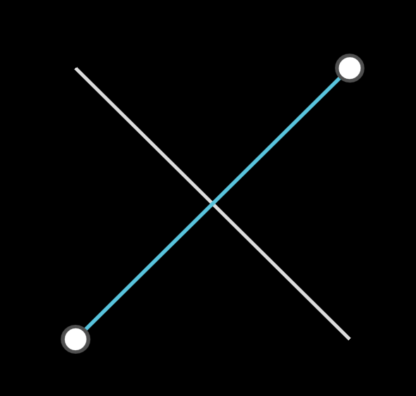

```python
    l1 = ELine(mn_coord(140, 140), mn_coord(300,300))

    p1 = EPoint(mn_coord(140,300))
    p2 = EPoint(mn_coord(300,140))
	l2 = ELine(p1,p2).blue()
```


## ELine Properties

| Property  | type       | Description                              |
| --------- | ---------- | ---------------------------------------- |
| `e_start` | `mn.Vect3` | the coordinates of the start of the line |
| `e_end`   | `mn.Vect3` | the coordinates of the end of the line   |
| `slope`   | `float`    | the slope of the line                    |
| `length`  | `float`    | the length of the line                   |


## Label

### `add_label(self, text, direction, side, alpha, buff, align) -> ELine`

| name        | type              | default                 | description                                                  |
| ----------- | ----------------- | ----------------------- | ------------------------------------------------------------ |
| `text`      | `str`             |                         | the string representation of the label                       |
| `direction` | ` mn.Vect3`       | `None`              | what direction do you want to put the label (up, down, right, left) (overides 'side' parameter).  Note that it goes in the direction based on the point calculated by `alpha`, and not 'up' of the line per se |
| `side`      | ``LineLabelSide`` | `LineLabelSide.OUTSIDE` | imagine a triangle drawn counter-clockwise, label inside or outside? |
| `alpha`     | `float`           | `0.5`                   | how far along the line (fraction) do you want the label      |
| `buff`      | `float`           | `LABEL_BUFF`            | how far away from the line do you want the label             |
| `align`        |      | `mn.ORIGIN`| which side to align the text to |

_Example_: labels
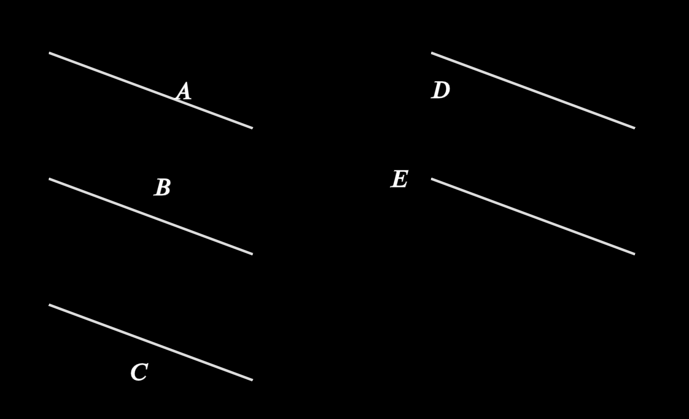

```python
    l1 = ELine(mn_coord(140, 140), mn_coord(300,200))
    l1.add_label('A',direction=mn.RIGHT)

    l2 = ELine(mn_coord(140, 240), mn_coord(300,300))
    l2.add_label('B',side=LineLabelSide.INSIDE)

    l3 = ELine(mn_coord(140, 340), mn_coord(300,400))
    l3.add_label('C',side=LineLabelSide.OUTSIDE)

    l4 = ELine(mn_coord(440, 140), mn_coord(600,200))
    l4.add_label('D',side=LineLabelSide.OUTSIDE, alpha = 0.1)

    l5 = ELine(mn_coord(440, 240), mn_coord(600,300))
    l5.add_label('E',direction=mn.LEFT, alpha = 0.0)
```

### `e_brace(self, direction, side, buff) ->mn.Brace`

### ` e_remove_brace(self)`

| name        | type              | default                 | description                                                  |
| ----------- | ----------------- | ----------------------- | ------------------------------------------------------------ |
| `direction` | ` mn.Vect3`       | `None`                  | what direction do you want to put the brace (up, down, right, left) (overides 'side' parameter) |
| `side`      | ``LineLabelSide`` | `LineLabelSide.OUTSIDE` | imagine a triangle drawn counter-clockwise, label inside or outside? |
| `buff`      | `float`           | `LABEL_BUFF`            | how far away from the line do you want the label             |

_Example:_ Brace
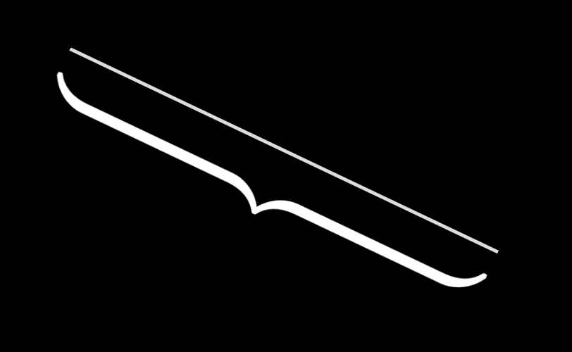

```python
    l = ELine(mn_coord(400,420),mn_coord(150,300))
    l.e_brace(side=LineLabelSide.INSIDE)
```


## Calculate Coordinate Methods


### `invert_start_and_end(self)`

reverses the direction of the line (swaps start and end points)

### `length_from_end(self, p: Point.EPoint) -> mn.Vect3`

### `length_from_start(self, p: Point.EPoint) -> mn.Vect3`

return length from point to start, or end, of line

| variable | type     | default | description |
| -------- | -------- | ------- | ----------- |
| `point`  | `EPoint` |         |             |


### `point(self, r)-> mn.Vect3`

Get point at distance `r` along the line.  Note that the point is not limited by the dimensions of the line

| variable             | type                     | default | description                                                  |
| -------------------- | ------------------------ | ------- | ------------------------------------------------------------ |
| `r`                  | `float`                  |         | the distance between the start of the line and the returned point |

_Example:_ point at distance `r`
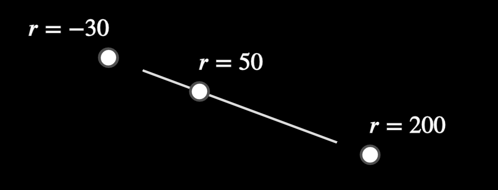

```python
    l1 = ELine(mn_coord(140, 140), mn_coord(300,200))
    
    p = l1.point(mn_scale(200))
    EPoint(p).add_label("r=200", align=mn.LEFT)
    
    p = l1.point(mn_scale(-30))
    EPoint(p).add_label("r=-30", align=mn.RIGHT)
    
    p = l1.point(mn_scale(50))
    EPoint(p).add_label("r=50", align=mn.LEFT)
```


## Intersection Methods

### `bisect(self) -> EPoint`

creates a point in the middle of the line
| variable   | type    | default | description                                                  |
| ---------- | ------- | ------- | ------------------------------------------------------------ |
| `speed`    | `float` | -1      | If `speed` is greater than zero it sets the speed of the animation used to calculate the midpoint, otherwise, only the EPoint will be drawn |
| `**kwargs` |         |         | animation arguments                                          |

_Example_:
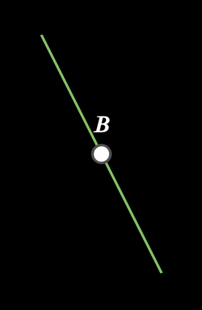

```python
    l = ELine(mn_coord(250,300),mn_coord(150,100)).green()
    p = l.bisect()
    p.add_label("B") 
```


### `intersect(self, other, reverse)-> list[mn.Vect3]`

returns the intersection points between this line and the other object.  

> NOTE: `intersect` **always** returns a list, even if it is an intersection between two lines

| variable  | type                                 | default | description                                            |
| --------- | ------------------------------------ | ------- | ------------------------------------------------------ |
| `other`   | `ELine`, `ECircle`, `EArc`, `EAngle` |         | the object which we want to see if our line intersects |
| `reverse` | `bool`                               | `True`  | not used                                               |

_Example_: Intersections
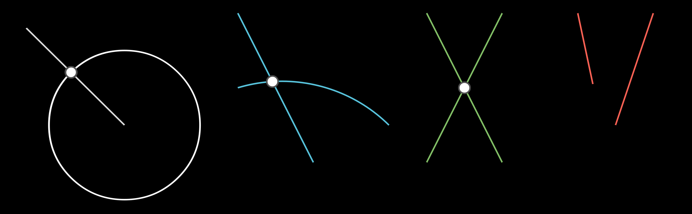

```python
    # intersects EArc
    l = ELine(mn_coord(500,300),mn_coord(400,100)).blue()
    a = EArc(mn_scale(200), mn_coord(600, 250), mn_coord(400, 200)).blue()
    intersections = l.intersect(a, reverse=True)
    for i in intersections:
        EPoint(i)

    # intersect circle
    l = ELine(mn_coord(120,120),mn_coord(250,250))
    c1 = ECircle(mn_coord(250,250),mn_coord(350,250))
    intersections = l.intersect(c1)
    for i in intersections:
        EPoint(i)

    # intersect line
    l = ELine(mn_coord(750,300),mn_coord(650,100)).green()
    l2 = ELine(mn_coord(650,300),mn_coord(750,100)).green()
    intersections = l.intersect(l2)
    for i in intersections:
        EPoint(i)
```


### `intersection_e_point(self, other: ELine)->Optional[Point.EPoint]`

creates and returns an `EPoint` object if the two lines intersect, else it does nothing

| variable | type    | default | description    |
| -------- | ------- | ------- | -------------- |
| `other`  | `ELine` |         | the other line |

_Example:_ instersection_point
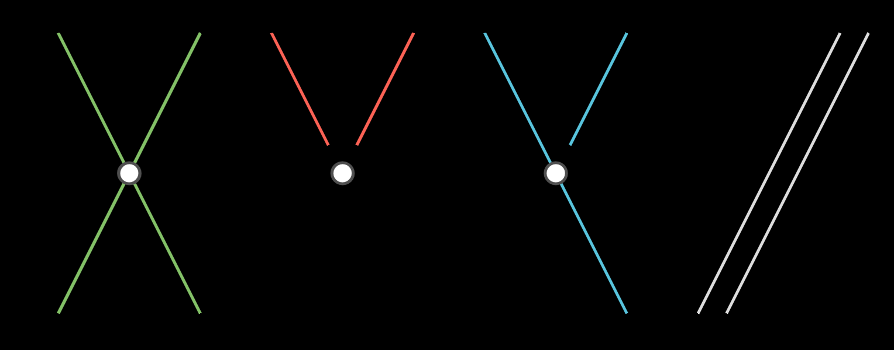

```python
    l = ELine(mn_coord(250,300),mn_coord(150,100)).green()
    l2 = ELine(mn_coord(150,300),mn_coord(250,100)).green()
    intersections = l.intersect_line(l2)
    for i in intersections:
        EPoint(i)

    l = ELine(mn_coord(360,180),mn_coord(400,100)).red()
    l2 = ELine(mn_coord(340,180),mn_coord(300,100)).red()
    intersections = l.intersect_line(l2)
    for i in intersections:
        EPoint(i)

    l = ELine(mn_coord(510,180),mn_coord(550,100)).blue()
    l2 = ELine(mn_coord(550,300),mn_coord(450,100)).blue()
    intersections = l.intersect_line(l2)
    for i in intersections:
        EPoint(i)

    l = ELine(mn_coord(600,300),mn_coord(700,100))
    l2 = ELine(mn_coord(620,300),mn_coord(720,100))
    intersections = l.intersect_line(l2)
    for i in intersections:
        EPoint(i)
```

## Modify Line Methods

### `e_split(self, points) -> list[Eline]`

Create new lines split on the specified point.  The original line is removed

| variable | type    | default | description    |
| -------- | ------- | ------- | -------------- |
| `*points` | `Iterable[EPoint | mn.Vect3]` |         | the points where you want to break the line into bits |

_Example:_
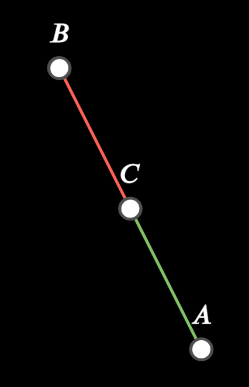

```python
    A = EPoint(mn_coord(250,300)).add_label("A")
    B = EPoint(mn_coord(150,100)).add_label("B")

    l = ELine(mn_coord(250,300),mn_coord(150,100)).green()

    C = l.bisect().add_label("C")

    lines = l.e_split(C)
    lines[0].green()
    lines[1].red()
```


### `extend(self, r) -> ELine`

extend the line past the end of the line by the amount specified by `r`
| variable | type    | default | description    |
| -------- | ------- | ------- | -------------- |
| `r`  |  |         | the distance |
| `**kwargs` |	|	| arguments used for animations |

### `prepend(self, r) -> ELine`

prepend at the beginning of  the line by the amount specified by `r`
| variable | type    | default | description    |
| -------- | ------- | ------- | -------------- |
| `r`  |  |         | the distance |
| `**kwargs` |	|	| arguments used for animations |

### `extend_and_prepend(self, r) -> ELine`
prepend and extend the line  by the amount specified by `r`
| variable | type    | default | description    |
| -------- | ------- | ------- | -------------- |
| `r`  |  |         | the distance |
| `**kwargs` |	|	| arguments used for animations |

### `extend_cpy(self, r) -> ELine`
create and return a **new** line that has been extend by `r`
| variable | type    | default | description    |
| -------- | ------- | ------- | -------------- |
| `r`  |  |         | the distance |
| `**kwargs` |	|	| arguments used for animations |

### `prepend(self, r) -> ELine`
create and return a **new** line that has been prepended by `r`
| variable | type    | default | description    |
| -------- | ------- | ------- | -------------- |
| `r`  |  |         | the distance |
| `**kwargs` |	|	| arguments used for animations |

_Example
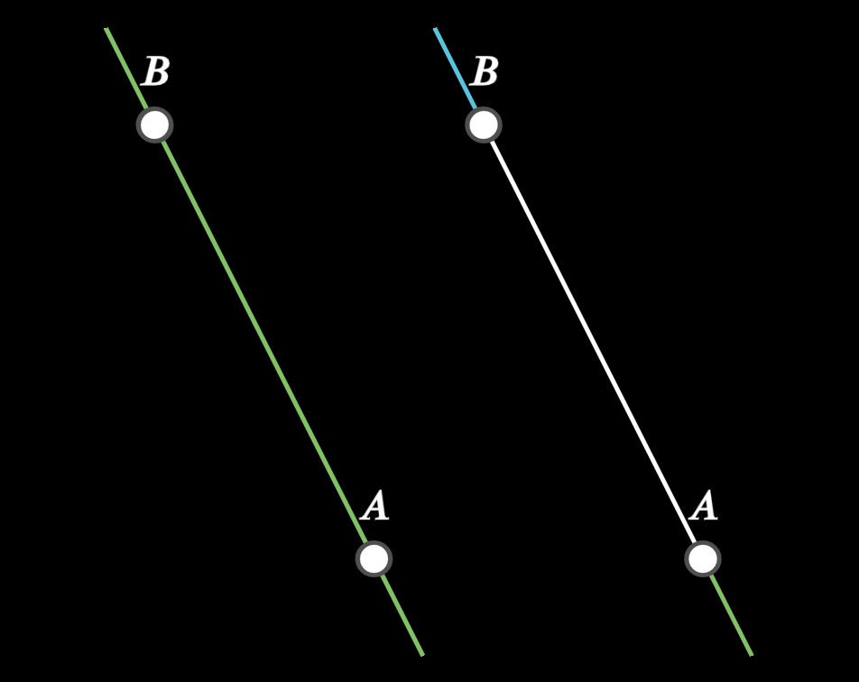

```python
    # adjusts existing line
    A = EPoint(mn_coord(250,300)).add_label("A")
    B = EPoint(mn_coord(150,100)).add_label("B")
    l = ELine(A,B).green()
    l.prepend(mn_scale(50))
    l.extend(mn_scale(50))

    # makes new lines
    A = EPoint(mn_coord(400,300)).add_label("A")
    B = EPoint(mn_coord(300,100)).add_label("B"
    l = ELine(A,B)
    l.prepend_cpy(mn_scale(50)).green()
    l.extend_cpy(mn_scale(50)).blue()

    # places original line on top of other lines
    l.white()
```

### `show_parts(self, num:int) -> list[ELine]`

Indicates the individual parts of the lines 
| variable   | type    | default | description                                                  |
| ---------- | ------- | ------- | ------------------------------------------------------------ |
| `num`     | `int` |         | a positive integer, which is used to divide the line into parts |

_Example:_
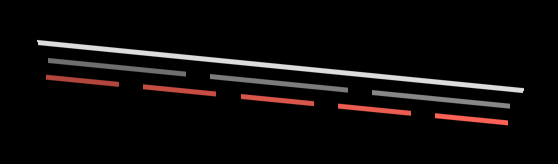

```python
    l = ELine(mn_coord(350,120),mn_coord(150,100))
    part_lines = l.show_parts(3)
    l.show_parts(5,buff=2*LINE_SHOW_PARTS_BUFF, color=mn.RED)
```


### `subtract(self, line) -> ELine`

Subtracts `line` from the end of `self`, and returns a new line (the original is _not_ destroyed)

| variable   | type    | default | description                                                  |
| ---------- | ------- | ------- | ------------------------------------------------------------ |
| `line`     | `ELine` |         | the line to subtract from self (subtracts the length of the line) |
| `speed`    | `float` | -1      | If `speed` is greater than zero it sets the speed of the animation the transformation |
| `**kwargs` |         |         | animation arguments                                          |

_Example:_
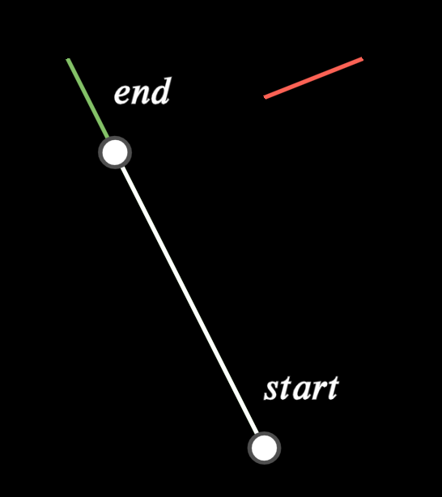

```python
    l = ELine(mn_coord(250,300),mn_coord(150,100)).green()
    l2 = ELine(mn_coord(300,100), mn_coord(250, 120)).red()
    
    l3 = l.subtract(l2, speed = 1).white()
    EPoint(l3.e_start).add_label('start', align=mn.DL)
    EPoint(l3.e_end).add_label('end', align=mn.DL)
```


## Construction Methods

### `copy_as_chord(self, c, p, clockwise=False)`
creates a line as a chord within a circle, with the same length as `self`

| name        | type              | default                 | description                                                  |
| ----------- | ----------------- | ----------------------- | ------------------------------------------------------------ |
| `circle`  | `ECircle`             |                         | the circle to draw the chord                     |
| `point`  | `EPoint`             |  `None`                    | the point where the chord starts (if the point is not on the circle, it is ignored)                     |
| `speed`    | `float` | -1      | If `speed` is greater than zero it sets the speed of the animation the transformation |
| `**kwargs` |         |         | animation arguments                                          |

_Example:_ 
<video controls width="300" height="200" poster="placeholder_image.png">
    <source src="./images/line_as_chord.mp4" type="video/mp4">
</video>

```python
    # copy line as chord, starting at angle 0 (default) with full animation
    l = ELine(mn_coord(300,300),mn_coord(400,300)).blue()
    c = ECircle(mn_coord(150,300), mn_coord(150,400))
    l.copy_as_chord(c, speed=10).blue()

    # copy line as chord starting at angle 120
    l = ELine(mn_coord(300,320),mn_coord(420,320)).green()
    l.copy_as_chord(c, EPoint(c.point_at_angle(3/2*mn.PI)),clockwise=True).green()

    # copy line same size as equator
    l = ELine(mn_coord(300,340),mn_coord(500,340))
    l.copy_as_chord(c)

    # line to long to fit into circle
    l = ELine(mn_coord(300,360),mn_coord(510,360)).red()
    chord = l.copy_as_chord(c)
    if chord is None:
        l.add_label(r"\text{too long}")
```

### `copy_to_line(self, target_point, target_line)-> tuple[ELine, Point.EPoint]`

Takes a line (`self`) and makes a copy of it onto another line (`target_line`), starting at `target_point` extending in the same direction as target_line.  In other words, the slope vector of target_line and the new_line will be the same.

| variable   | type    | default | description                                                  |
| ---------- | ------- | ------- | ------------------------------------------------------------ |
| `target_point`     | `EPoint` |         | the start point of the new line |
| `target_line`     | `ELine` |         | what line do you want it drawn on? |
| `speed`    | `float` | -1      | If `speed` is greater than zero it sets the speed of the animation the transformation |
| `**kwargs` |         |         | animation arguments                                          |

_Example:_ copy to point with and without animation
<video controls width="300" height="200" poster="placeholder_image.png">
    <source src="./images/line_copy_to_line.mp4" type="video/mp4">
</video>

```python
   # the line we want to copy
    l = ELine(mn_coord(300,320),mn_coord(150,300)).blue()

    # the line we want to copy to (target_line)
    p1 = EPoint(mn_coord(150,400),label="A")
    p2 = EPoint(mn_coord(400, 400),label="B")
    l1 = ELine(p1,p2).green()

    # get the starting point of line.  It will be drawn in the same direction as the target_line is drawn
    # (from start to end
    location = EPoint(l1.point(mn_scale(50))).add_label(r"\alpha")
    l_new, p_new = l.copy_to_line(location, l1)
    p_new.add_label(r"\beta")
    l_new.red()


    # the line we want to copy to (target_line)
    p1 = EPoint(mn_coord(100, 500), label='A')
    p2 = EPoint(mn_coord(200, 500), label='B')
    l1 = ELine(p1, p2).green()

    # get the starting point of line.  It will be drawn in the same direction as the target_line is drawn
    # (from start to end
    location = EPoint(l1.point(mn_scale(50))).add_label(r"\alpha")
    l_new, p_new = l.copy_to_line(location, l1, speed=2)
    p_new.add_label(r"\beta")
    l_new.red()

```

### `copy_to_point(self, target) -> tuple[ELine, Point.EPoint]`

Take a given line, and create a new line that starts at `target` and is the same length as the original line
| variable   | type    | default | description                                                  |
| ---------- | ------- | ------- | ------------------------------------------------------------ |
| `target`     | `EPoint` |         | the point on which to draw the new line |
| `speed`    | `float` | -1      | If `speed` is greater than zero it sets the speed of the animation the transformation |
| `**kwargs` |         |         | animation arguments                                          |

_Example:_ copy to point with and without animation
<video controls width="300" height="200" poster="placeholder_image.png">
    <source src="./images/line_to_point.mp4" type="video/mp4">
</video>

```python
    l = ELine(mn_coord(350,120),mn_coord(150,100)).blue()
    p = EPoint(mn_coord(250,180)).blue()
    
    # construction not animated
    l1,p1 = l.copy_to_point(p)
    l1.red()
    p1.red()

    # construction is animated
    l = ELine(mn_coord(350,120),mn_coord(150,100)).blue()
    p = EPoint(mn_coord(200,200)).blue()
    l.copy_to_point(p,speed = 2)
```


### `parallel(self, point) -> ELine`
creates a line parallel to `self` goint through the specified point

| name        | type              | default                 | description                                                  |
| ----------- | ----------------- | ----------------------- | ------------------------------------------------------------ |
| `point`  | `EPoint`             |                         | the point where the perpendicular starts                     |
| `speed`    | `float` | -1      | If `speed` is greater than zero it sets the speed of the animation the transformation |
| `**kwargs` |         |         | animation arguments                                          |

_Example:_ draw perpendicular from point to line and draw perpendicular from point of line
<video controls width="300" height="200" poster="placeholder_image.png">
    <source src="./images/line_parallel.mp4" type="video/mp4">
</video>

```python
    l = ELine(mn_coord(400,420),mn_coord(150,300))
    p = EPoint(mn_coord(300,200))
    l2 = l.parallel(p, speed=2)
    l2.green()

    p = EPoint(mn_coord(200,200))
    l2 = l.parallel(p)
    l2.blue()
```

### `perpendicular(self, point, side, ] -> ELine`

Draws a line perpendicular to `self` which starts at the specified point

| name        | type              | default                 | description                                                  |
| ----------- | ----------------- | ----------------------- | ------------------------------------------------------------ |
| `point`  | `EPoint`             |                         | the point where the perpendicular starts                     |
| `side`      | ``LineLabelSide`` | `LineLabelSide.OUTSIDE` | imagine a triangle drawn counter-clockwise, label inside or outside? |
| `speed`    | `float` | -1      | If `speed` is greater than zero it sets the speed of the animation the transformation |
| `**kwargs` |         |         | animation arguments                                          |

_Example:_ draw perpendicular from point to line and draw perpendicular from point of line
<video controls width="300" height="200" poster="placeholder_image.png">
    <source src="./images/line_perpendicular.mp4" type="video/mp4">
</video>
```python
    l = ELine(mn_coord(400,420),mn_coord(150,300))

    # drop a perpendicular - fully animated
    p = EPoint(mn_coord(300,200))
    l.perpendicular(p,speed=2)

    # draw perpendicular from line - not fully animated
    p = EPoint(l.point(mn_scale(50)))
    l.perpendicular(p)
```

### `square(self, clockwise)->tuple[ELine, ELine, ELine)`

Draw three more lines to create a square (NOT a polygon or ESquare object though)
By default, the square is drawn from the start of the line in an anti-clockwise direction, which determines which side of the line that the square is drawn on

| name        | type              | default                 | description                                                  |
| ----------- | ----------------- | ----------------------- | ------------------------------------------------------------ |
| `clockwise`  | `bool`             |  `False`              | should the square be drawn clockwise?                        ||
| `speed`    | `float` | -1      | If `speed` is greater than zero it sets the speed of the animation the transformation |
| `**kwargs` |         |         | animation arguments                                          |

_Example:_ 
<video controls width="300" height="200" poster="placeholder_image.png">
    <source src="./images/line_square.mp4" type="video/mp4">
</video>
```python
    l2 = ELine(mn_coord(300,150),mn_coord(400,150)).add_label(r'\rightarrow')
    l3, l4, l1 = l2.square(speed=2)
    l1.blue()
    l2.green()
    l3.red()
    l4.white()

    l2 = ELine(mn_coord(550,150),mn_coord(450,150)).add_label(r'\leftarrow')
    l3, l4, l1 = l2.square()
    l1.blue()
    l2.green()
    l3.red()
    l4.white()

    l2 = ELine(mn_coord(450,300),mn_coord(550,300)).add_label(r'\rightarrow')
    l3, l4, l1 = l2.square(clockwise=True)
    l1.blue()
    l2.green()
    l3.red()
    l4.white()

    l2 = ELine(mn_coord(400,300),mn_coord(300,300)).add_label(r'\leftarrow')
    l3, l4, l1 = l2.square(clockwise=True)
    l1.blue()
    l2.green()
    l3.red()
    l4.white()

```


## Class Methods


### `mean_proportional(cls, l1, l2, pt, angle)`
CLASS METHOD!! Take two lines and construct a third line of length that is the mean proportional of the first and second line.
| name        | type              | default                 | description                                                  |
| ----------- | ----------------- | ----------------------- | ------------------------------------------------------------ |
| `l1`  | `ELine`             |                         | first line                    |
| `l2`  | `ELine`             |                         | second line                    |
| `pt`  | `EPoint`             |                         | the starting point of the constructed line                    |
| `angle`  | `float`             |  0                       | what angle will the mean proportional be drawn                    |
| `speed`    | `float` | -1      | If `speed` is greater than zero it sets the speed of the animation the transformation |
| `**kwargs` |         |         | animation arguments                                          |

_Example:_ 
<video controls width="300" height="200" poster="placeholder_image.png">
    <source src="./images/line_mean_proportional.mp4" type="video/mp4">
</video>

```python
    p = EPoint(mn_coord(300,100))
    l2 = ELine(mn_coord(300,150),mn_coord(400,150)).add_label(r'a')
    l1 = ELine(mn_coord(300,200),mn_coord(600,200)).add_label(r'b')
    l3 = ELine.mean_proportional(l1,l2,p)   # CLASS METHOD
    l3.add_label(r'\sqrt{ab}')
```


### `third_proportional(cls, l1, l2, pt, angle)->EPoint`

CLASS METHOD!! Calculate the third proportional $x$ ($a:b = b:x$)
| name        | type              | default                 | description                                                  |
| ----------- | ----------------- | ----------------------- | ------------------------------------------------------------ |
| `l1`  | `ELine`             |                         | first line                    |
| `l2`  | `ELine`             |                         | second line                    |
| `pt`  | `EPoint`             |                         | the starting point of the constructed line                    |
| `angle`  | `float`             |  0                       | what angle will the mean proportional be drawn                    |
| `speed`    | `float` | -1      | If `speed` is greater than zero it sets the speed of the animation the transformation |
| `**kwargs` |         |         | animation arguments                                          |

_Example:_ 
<video controls width="300" height="200" poster="placeholder_image.png">
    <source src="./images/line_third.mp4" type="video/mp4">
</video>
```python
    t1 = TextBox(mn_coord(400, 50))
    t1.math(r"a:b = b:x")

    p = EPoint(mn_coord(400,100))
    l1 = ELine(mn_coord(400,150),mn_coord(500,150)).add_label(r'a')
    l2 = ELine(mn_coord(400,200),mn_coord(600,200)).add_label(r'b')
    l3 = ELine.third_proportional(l1,l2,p)
    l3.add_label(r'x=b^2/a')

    p = EPoint(mn_coord(500,300))
    l1 = ELine(mn_coord(500,350),mn_coord(600,350)).add_label(r'a')
    l2 = ELine(mn_coord(500,400),mn_coord(700,400)).add_label(r'b')
    l3 = ELine.third_proportional(l1,l2,p,speed=2)
```


### `fourth_proportional(cls, l1, l2, l3, pt, angle)->EPoint`

CLASS METHOD!! Calculate the fourth proportional $x$ ($a:b = c:x$)
| name        | type              | default                 | description                                                  |
| ----------- | ----------------- | ----------------------- | ------------------------------------------------------------ |
| `l1`  | `ELine`             |                         | first line                    |
| `l2`  | `ELine`             |                         | second line                    |
| `l3`  | `ELine`             |                         | third line                    |
| `pt`  | `EPoint`             |                         | the starting point of the constructed line                    |
| `angle`  | `float`             |  0                       | what angle will the mean proportional be drawn                    |
| `speed`    | `float` | -1      | If `speed` is greater than zero it sets the speed of the animation the transformation |
| `**kwargs` |         |         | animation arguments                                          |

_Example:_ 
<video controls width="300" height="200" poster="placeholder_image.png">
    <source src="./images/line_fourth.mp4" type="video/mp4">
</video>
```python
    t1 = TextBox(mn_coord(300, 50))
    t1.math(r"a:b = c:x")

    p = EPoint(mn_coord(300,100))
    l1 = ELine(mn_coord(300,150),mn_coord(400,150)).add_label(r'a=1')
    l2 = ELine(mn_coord(300,200),mn_coord(500,200)).add_label(r'b=2')
    l3 = ELine(mn_coord(300,250),mn_coord(600,250)).add_label(r'c=3')
    l4 = ELine.fourth_proportional(l1,l2,l3,p,speed=2)
    l4.add_label(r'x=(bc)/a = 6')
```

