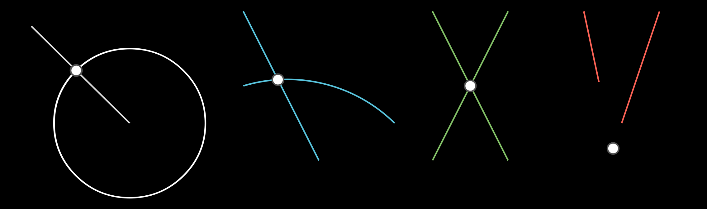

# ELine

> [base methods and properties](./base_object_documentation.md)

```
def __init__(self, start: EMObject | mn.Vect3, end: EMObject | mn.Vect3 | None = None, *args, **kwargs):
```


## Arguments

| variable          | type                     | default | description                                                  |
| ----------------- | ------------------------ | ------- | ------------------------------------------------------------ |
| `start`           | `Point.EPoint, mn.Vect3` |         | the coordinates or point of the start of the line            |
| `end`             | `Point.EPoint, mn.Vect3` |         | the coordinates or point of the end of the line              |
| `stroke_width` | `float` | 2        | the width of the line outlining the object |
| `label`/`label_args` | `str`, `tuple[str,dict]` | `None`         | Instead of using the method `add_label`, you can add a label here |
| `**kwargs`           |                          |         | Extra arguments for the animation                            |

_Example:_


```python
    l1 = ELine(mn_coord(140, 140), mn_coord(300,300))

    p1 = EPoint(mn_coord(140,300))
    p2 = EPoint(mn_coord(300,140))
	l2 = ELine(p1,p2).blue()
```


## ELine Properties

| Property | type       | Description                              |
| -------- | ---------- | ---------------------------------------- |
| `start`  | `mn.Vect3` | the coordinates of the start of the line |
| `end`    | `mn.Vect3` | the coordinates of the end of the line   |
| `slope`  | `float`    | the slope of the line                    |
| `length` | `float`    | the length of the line                   |


## 

## Label

### `add_label(self, text, direction, side, alpha, buff, align) -> ELine`


### Label Arguments

| name        | type              | default                 | description                                                  |
| ----------- | ----------------- | ----------------------- | ------------------------------------------------------------ |
| `text`      | `str`             |                         | the string representation of the label                       |
| `direction` | ` mn.Vect3`       | `mn.UP`                 | what direction do you want to put the label (up, down, right, left) (overides 'side' parameter).  Note that it goes in the direction based on the point calculated by `alpha`, and not 'up' of the line per se |
| `side`      | ``LineLabelSide`` | `LineLabelSide.OUTSIDE` | imagine a triangle drawn counter-clockwise, label inside or outside? |
| `alpha`     | `float`           | `0.5`                   | how far along the line (fraction) do you want the label      |
| `buff`      | `float`           | `LABEL_BUFF`            | how far away from the line do you want the label             |
| `align`        |      | `mn.ORIGIN`| which side to align the text to |


_Example_: labels


```python
    l1 = ELine(mn_coord(140, 140), mn_coord(300,200))
    l1.add_label('A',direction=mn.RIGHT)

    l2 = ELine(mn_coord(140, 240), mn_coord(300,300))
    l2.add_label('B',side=LineLabelSide.INSIDE)

    l3 = ELine(mn_coord(140, 340), mn_coord(300,400))
    l3.add_label('C',side=LineLabelSide.OUTSIDE)

    l4 = ELine(mn_coord(440, 140), mn_coord(600,200))
    l4.add_label('D',side=LineLabelSide.OUTSIDE, alpha = 0.1)

    l5 = ELine(mn_coord(440, 240), mn_coord(600,300))
    l5.add_label('E',direction=mn.LEFT, alpha = 0.0)
```

## Methods

### `invert_start_and_end(self)`

reverses the direction of the line (swaps start and end points)

### `point(self, r)->mn.Vect3`

Get point at distance `r` along the line.  Note that the point is not limited by the dimensions of the line

### Arguments

| variable             | type                     | default | description                                                  |
| -------------------- | ------------------------ | ------- | ------------------------------------------------------------ |
| `r`                  | `float`                  |         | the distance between the start of the line and the returned point |

_Example:_ point at distance `r`


```python
    l1 = ELine(mn_coord(140, 140), mn_coord(300,200))
    
    p = l1.point(mn_scale(200))
    EPoint(p).add_label("r=200", align=mn.LEFT)
    
    p = l1.point(mn_scale(-30))
    EPoint(p).add_label("r=-30", align=mn.RIGHT)
    
    p = l1.point(mn_scale(50))
    EPoint(p).add_label("r=50", align=mn.LEFT)
```


### `intersect(self, other, reverse)-> list[mn.Vect3]`

returns the intersection points between this line and the other object.  

> If the `other` is an `ELine`, then the intersection will be returned as if both lines were infinite

### Arguments

| variable  | type                                 | default | description                                            |
| --------- | ------------------------------------ | ------- | ------------------------------------------------------ |
| `other`   | `ELine`, `ECircle`, `EArc`, `EAngle` |         | the object which we want to see if our line intersects |
| `reverse` | `bool`                               | `True`  | not used                                               |

_Example_: Intersections



```python

# =====================================================================================================================
# Line
# =====================================================================================================================
class ELine(Dashable.Dashable, EMObject, mn.Line):


    # -----------------------------------------------------------------------------------------------------------------
    # find intersection between line, and another bound line (as opposed to an infinite line)
    # -----------------------------------------------------------------------------------------------------------------
    def intersect_bound_line(self, l2: mn.Line):
        (x1, y1, _), (x2, y2, _) = self.get_start_and_end()
        (x3, y3, _), (x4, y4, _) = l2.get_start_and_end()
        uA = ((x4 - x3) * (y1 - y3) - (y4 - y3) * (x1 - x3)) / ((y4 - y3) * (x2 - x1) - (x4 - x3) * (y2 - y1))
        uB = ((x2 - x1) * (y1 - y3) - (y2 - y1) * (x1 - x3)) / ((y4 - y3) * (x2 - x1) - (x4 - x3) * (y2 - y1))

        if not (0 <= uA <= 1 and 0 <= uB <= 1):
            return False
        x = x1 + (uA * (x2 - x1))
        y = y1 + (uA * (y2 - y1))
        return x, y, 0

    # -----------------------------------------------------------------------------------------------------------------
    # find intersection of line, and other infinite line
    # -----------------------------------------------------------------------------------------------------------------
    def intersect_line(self, l2: mn.Line):
        (x00, y00, _), (x01, y01, _) = self.get_start_and_end()
        (x10, y10, _), (x11, y11, _) = l2.get_start_and_end()
        m1 = self.get_e_slope()
        m2 = l2.get_e_slope()

        if abs(m1 - m2) < 0.1:
            return

        if abs(m1) > 1e10:
            x = x00
            y = m2 * (x - x10) + y10
        elif abs(m2) > 1e10:
            x = x10
            y = m1 * (x - x00) + y00
        else:
            x = (y11 - y00 + m1 * x00 - m2 * x11) / (m1 - m2)
            y = m1 * (x - x00) + y00

        return np.array([x, y, 0])

    # -----------------------------------------------------------------------------------------------------------------
    # get distance along line from point to end of line
    # -----------------------------------------------------------------------------------------------------------------
    def length_from_end(self, p: Point.EPoint):
        return p.distance_to(self.get_end())

    # -----------------------------------------------------------------------------------------------------------------
    # get distance along line from point to start of line
    # -----------------------------------------------------------------------------------------------------------------
    def length_from_start(self, p: Point.EPoint):
        return p.distance_to(self.get_start())

    # -----------------------------------------------------------------------------------------------------------------
    # get slope of line
    # -----------------------------------------------------------------------------------------------------------------
    def get_e_slope(self) -> float:
        (x1, y1, _), (x2, y2, _) = self.get_start_and_end()
        if abs(x2 - x1) < mn_scale(1):
            if abs(y2 - y1) < mn_scale(1):
                return math.nan
            if y2 > y1:
                return math.inf
            return -math.inf

        return (y2 - y1) / (x2 - x1)

    # -----------------------------------------------------------------------------------------------------------------
    # extend/prepend the line by 'r' amount
    # -----------------------------------------------------------------------------------------------------------------
    def _extend(self, anim: ELine, r: float):
        e_end = self.point(r + self.get_length())
        anim.set_points_by_ends(self.get_start(), e_end)
        return self

    def _prepend(self, anim: ELine, r: float):
        e_start = self.point(-r)
        anim.set_points_by_ends(e_start, self.get_end())
        return self

    @animate
    def extend(self, anim: ELine, r: float):
        if r < 0:
            return self._prepend(anim, -r)
        return self._extend(anim, r)

    @animate
    def prepend(self, anim: ELine, r: float):
        if r < 0:
            return self._extend(anim, -r)
        return self._prepend(anim, r)

    @animate
    def extend_and_prepend(self, anim: ELine, r: float):
        r = abs(r)
        e_end = self.point(r + self.get_length())
        e_start = self.point(-r)
        anim.set_points_by_ends(e_start, e_end)
        return self

    def extend_cpy(self, r: float):
        if r < 0:
            return self.prepend_cpy(-r)
        x2, y2, _ = self.point(r + self.get_length())
        return ELine(self.get_end(), (x2, y2, 0))

    def prepend_cpy(self, r: float):
        x2, y2, _ = self.point(-r)
        return ELine(self.get_start(), (x2, y2, 0))

    # -----------------------------------------------------------------------------------------------------------------
    # copy line to the specified point
    # -----------------------------------------------------------------------------------------------------------------
    @log
    @copy_transform(index=0)
    def copy_to_point(self, target: Point.EPoint) -> tuple[ELine, Point.EPoint]:
        A = self.get_start()
        B = self.get_end()
        C = self.pointify(target)

        l: dict[str | int, ELine] = {}
        p: dict[str | int, Point.EPoint] = {}
        c: dict[str | int, Circle.ECircle] = {}
        t: dict[str | int, Triangle.ETriangle] = {}

        # ------------------------------------------------------------------------
        # If point is already on the line, just make a clone, and return results
        # ------------------------------------------------------------------------
        if abs(A[0] - C[0]) < mn_scale(0.1) and abs(A[1] - C[1]) < mn_scale(0.1):
            lCF = self.copy()
            pF = Point.EPoint(C, scene=self.scene)
            return lCF, pF

        # ------------------------------------------------------------------------
        # Copy the line to the new point using methods from proposition 2
        # ------------------------------------------------------------------------

        # join the two lines
        l['AC'] = ELine(A, C, scene=self.scene).e_fade()

        # construct equilateral on above line (D = apex of triangle)
        t[1] = EquilateralTriangle.build(A, C)
        p['D'] = t[1].p[-1]
        l['AD'] = t[1].l[2]
        l['CD'] = t[1].l[1]
        with self.scene.simultaneous():
            parts: dict[int, EMObject] = {id(x): x for x in t[1].get_e_family()}
            del parts[id(l['AD'])]
            del parts[id(l['CD'])]
            for part in parts.values():
                part.e_fade()

        def find_extended_intersection(p1, p2, circle, line, extend_dir=1, find_min=False):
            c[circle] = Circle.ECircle(p1, p2, scene=self.scene).e_fade()
            pts = c[circle].intersect(l[line])
            # self.add(l[line])
            for _ in range(15):
                if pts and not find_min:
                    break
                if pts and find_min:
                    minim = min(abs(self.get_length() - get_dist(a, C)) for a in pts)
                    if minim < mn_scale(0.1):
                        break
                l[line].extend(mn_scale(100 * extend_dir), rate_func=mn.linear)
                pts = c[circle].intersect(l[line])
            else:
                raise Exception("Infinite Loop")
            return pts

        pts = find_extended_intersection(A, B, 'C', 'AD', -1)

        p['E'] = Point.EPoint(pts[0], scene=self.scene)
        p['B'] = Point.EPoint(B, scene=self.scene)

        if p['D'].distance_to(pts[0]) > mn_scale(1):
            F = find_extended_intersection(p['D'], p['E'], 'D', 'CD', find_min=True)
        else:
            F = [p['E'].get_center()]

        new_end = min(F, key=lambda a: abs(self.get_length() - get_dist(a, C)))
        pF = Point.EPoint(new_end)
        lCF = ELine(C, new_end)

        with self.scene.simultaneous():
            mobjs: dict[int, EMObject] = {id(x): x for group in (p, l, c) for x in group.values()}
            mobjs |= {id(x): x for x in t[1].get_e_family()}
            for obj in mobjs.values():
                obj.e_remove()
        return lCF, pF

    # -----------------------------------------------------------------------------------------------------------------
    # copy line to another line?
    # - note that copy_transform adjusts the animation speeds etc, before running this code (in EuclidMObject)
    #   args to copy_transform ... (self: EMObject, *args, speed=-1, no_anim=False, **kwargs)
    # -----------------------------------------------------------------------------------------------------------------
    @log
    @copy_transform(index=0)
    def copy_to_line(self, target: Point.EPoint, target_line: ELine):
        tp = target
        if not isinstance(target, Point.EPoint):
            tp = Point.VirtualPoint(tp)

        target_coord = convert_to_coord(target)
        lx, px = self.copy_to_point(target, speed=0)
        if lx is None or px is None:
            raise Exception("Failed To Copy To Point")

        c = Circle.ECircle(target, lx.get_end())

        clone = target_line.copy()
        for _ in range(1000):
            p = c.intersect(clone)
            if p is not None and len(p):
                break
            if target_line.length_from_end(tp) > target_line.length_from_start(tp):
                clone.extend(c.get_radius() / 2)
            else:
                clone.prepend(c.get_radius() / 2)
        else:
            with self.scene.simultaneous():
                px.e_remove()
                lx.blue()
                c.e_remove()
                clone.e_remove()
            return lx, px

        ref_p = min(p, key=lambda x:
                                    abs(
                                        mn.angle_of_vector(x - target_coord) -
                                        mn.angle_of_vector(self.get_vector())
                                        )
                    )
        np = Point.EPoint(ref_p)
        nl = ELine(tp, np)

        if abs(self.get_length() - nl.get_length()) > mn_scale(0.1):
            np.e_remove()
            nl.extend(self.get_length() - nl.get_length())
            np = Point.EPoint(nl.get_end())

        with self.scene.simultaneous():
            px.e_remove()
            lx.e_remove()
            c.e_remove()
            if tp.Virtual:
                tp.e_remove()
            if clone.in_scene():
                clone.e_remove()
        return nl, np

    # -----------------------------------------------------------------------------------------------------------------
    # add/remove a brace to an ELine
    # -----------------------------------------------------------------------------------------------------------------
    def e_brace(self, direction=None, buff=LabelBuff * 2):
        if not direction:
            direction = self.OUT()
        brace = mn.Brace(self, direction=direction, buff=buff)
        self.scene.play(mn.FadeInFromPoint(brace, point=self.e_label.get_center()))
        self.brace = brace

    def e_remove_brace(self):
        if self.brace is not None:
            self.scene.play(mn.FadeOut(self.brace))
        self.brace = None

    # -----------------------------------------------------------------------------------------------------------------
    # rotate to
    # -----------------------------------------------------------------------------------------------------------------
    @log
    def e_rotate_to(self, angle: float):
        theta = angle - self.get_angle()
        if theta > mn.PI:
            theta -= mn.TAU
        if theta < -mn.PI:
            theta += mn.TAU
        return self.e_rotate(self.get_start(), theta)

    # -----------------------------------------------------------------------------------------------------------------
    # split string into parts
    # -----------------------------------------------------------------------------------------------------------------
    def e_split(self, *points: mn.Mobject | mn.Vect3):
        cls = type(self)
        coords = [self.get_start(), *map(self.pointify, points), self.get_end()]
        lines = [
            cls(p1, p2, skip_anim=True).set_stroke(opacity=float(self.get_stroke_opacity()))
            for p1, p2 in pairwise(coords)
        ]
        self.e_delete()
        return lines

    # -----------------------------------------------------------------------------------------------------------------
    # bisect the line
    # -----------------------------------------------------------------------------------------------------------------
    @anim_speed
    def bisect(self):
        cls = type(self)
        c1 = Circle.ECircle(*self.get_start_and_end()[::-1]).e_fade()
        c2 = Circle.ECircle(*self.get_start_and_end()).e_fade()
        pts = c1.intersect(c2)
        l = cls(*pts).e_fade()

        pt = Point.EPoint(l.intersect(self))
        with self.scene.simultaneous():
            c1.e_remove()
            c2.e_remove()
            l.e_remove()
        return pt

    # -----------------------------------------------------------------------------------------------------------------
    # drop a perpendicular
    # -----------------------------------------------------------------------------------------------------------------
    @log
    @anim_speed
    def _perp_off_line(self, p: Point.EPoint, dist_end: float, dist_start: float):
        A, B = self.get_start_and_end()
        C = self.pointify(p)
        p: dict[str, Point.EPoint] = {}
        c: dict[str, Circle.ECircle] = {}
        l: ELine = self.copy().e_fade()
        l.extend_and_prepend(mn_scale(40))

        # draw a circle with the lesser of $re,$rs as the radius
        radius = min(dist_end, dist_start)
        c['C'] = Circle.ECircle(C, C + mn.RIGHT * (radius + mn_scale(10)))

        # define two points equidistance from our initial point
        for num in range(0, 10):
            pts = c['C'].intersect(l)
            if len(pts) == 2:
                break
            l.extend_and_prepend(mn_scale(100))

        p['D'] = Point.EPoint(pts[0])
        p['E'] = Point.EPoint(pts[1])
        c['C'].e_remove()

        lb = ELine(*pts).e_fade()
        pb = lb.bisect(speed=0)
        lfinal = ELine(C, pb)
        with self.scene.simultaneous():
            p['D'].e_remove()
            p['E'].e_remove()
            lb.e_remove()
            pb.e_remove()
            l.e_remove()
        return lfinal

    # -----------------------------------------------------------------------------------------------------------------
    # drop a perpendicular from the line
    # -----------------------------------------------------------------------------------------------------------------
    @log
    @anim_speed
    def _perp_on_line(self, p: Point.EPoint, dist_end: float, dist_start: float, /, inside=False):
        A, B = self.get_start_and_end()
        C = self.pointify(p)
        l: dict[str, ELine] = {}
        p: dict[str, Point.EPoint] = {}
        c: dict[str, Circle.ECircle] = {}
        ln: ELine = self.copy().e_fade()

        radius = max(dist_start, dist_end)
        ln.extend(dist_start - dist_end)
        c['C'] = Circle.ECircle(C, C + mn.RIGHT * radius)

        # define two points equidistance from our initial point
        pts = c['C'].intersect(ln)
        p['D'] = Point.EPoint(pts[0])
        p['E'] = Point.EPoint(pts[1])

        c['C'].e_remove()

        # find 3rd point of equilateral triangle, without drawing lines
        c1 = Circle.ECircle(p['D'], p['E'])
        c2 = Circle.ECircle(p['E'], p['D'])
        pts = c1.intersect(c2)

        # if point is at either end of the line, check for positive/negative
        # options, otherwise go with defaults;
        if mn.get_norm(A - C) < mn_scale(.1) or mn.get_norm(B - C) < mn_scale(.1):
            l1 = ELine(C, pts[1], delay_anim=True)
            l2 = ELine(C, pts[0], delay_anim=True)
            a1 = Angle.calculateAngle(self, l1)
            a2 = Angle.calculateAngle(self, l2)

            if inside:
                l2, l1 = l1, l2

            if abs(a1 - mn.PI / 2) < 0.1 * mn.DEGREES:
                l['CF'] = l1
                l2.e_delete()
            elif abs(a2 - mn.PI / 2) < 0.1 * mn.DEGREES:
                l['CF'] = l2
                l1.e_delete()
            else:
                raise ArithmeticError(f"Bad Angles {a1=} and {a2=}")
            l['CF'].e_draw()
        else:
            l['CF'] = ELine(C, pts[int(inside)])

        with self.scene.simultaneous():
            p['D'].e_remove()
            p['E'].e_remove()
            c1.e_remove()
            c2.e_remove()
            ln.e_remove()
        return l['CF']

    # -----------------------------------------------------------------------------------------------------------------
    # perpendicular
    # -----------------------------------------------------------------------------------------------------------------
    @log
    @anim_speed
    def perpendicular(self, p: Point.EPoint, /, inside=False, negative=False):
        inside = inside or negative
        rs = mn.get_norm(self.pointify(p) - self.get_start())
        re = mn.get_norm(self.pointify(p) - self.get_end())
        if (rs + re - self.get_length()) > mn_scale(0.1):
            return self._perp_off_line(p, re, rs, speed=0)
        return self._perp_on_line(p, re, rs, inside=inside, speed=0)

    # -----------------------------------------------------------------------------------------------------------------
    # draw a line parallel going through a point
    # -----------------------------------------------------------------------------------------------------------------
    @log
    @anim_speed
    def parallel(self, p: Point.EPoint):
        B, C = self.get_start_and_end()
        A = p.coordinates

        # make sure line goes from left to right
        if B[0] > C[0]:
            B, C = C, B

        with self.scene.trace(self, "define a new line"):
            tempC = C
            if get_dist(B, C) < mn_scale(100):
                tempC = C + mn.normalize(C - B) * mn_scale(100)
            ln = ELine(B, tempC, stroke_color=mn.GREEN)

        # is point on the line?
        rs = self.length_from_start(p)
        re = self.length_from_end(p)
        if abs(rs + re - self.get_length()) < mn_scale(0.1):
            clone = self.copy()
            ln.e_remove()
            return clone

        with self.scene.trace(ln, "create point D on the line"):
            pD = Point.EPoint(ln.point_from_proportion(0.5))
            lBD, lDC = ln.e_split(pD)
            lAD = ELine(A, pD, stroke_color=mn.BLUE)

        with self.scene.trace(mn.VGroup(lDC, lAD), "copy angle"):
            aADC = Angle.EAngle(lDC, lAD)
            lEA, angle = aADC.copy_to_line(p, lAD, negative=True, speed=0)
        with self.scene.trace(lEA, "extend the line"):
            lEA.prepend(mn_scale(200))

        # cleanup
        with self.scene.staggered_animation():
            aADC.e_remove()
            angle.e_remove()
            pD.e_remove()
            lAD.e_remove()
            lDC.e_remove()
            lBD.e_remove()
            ln.e_remove()

        return lEA

    # @deprecated('Use .dash()')
    # def dashed(self):
    #     dd = EDashedLine(*self.get_start_and_end(),
    #                      skip_anim=True,
    #                      stroke_color=self.get_stroke_color(),
    #                      stroke_width=float(self.get_stroke_width()),
    #                      stroke_opacity=float(self.get_stroke_opacity()))
    #     self.scene.play(mn.FadeOut(self))
    #     return dd
    #
    # @deprecated("Use copy().dash()")
    # def dashed_copy(self):
    #     dd = EDashedLine(*self.get_start_and_end(),
    #                      skip_anim=True,
    #                      stroke_color=self.get_stroke_color(),
    #                      stroke_width=float(self.get_stroke_width()),
    #                      stroke_opacity=float(self.get_stroke_opacity()))
    #     return dd

    # -----------------------------------------------------------------------------------------------------------------
    # calculate the golden ratio on the line
    # -----------------------------------------------------------------------------------------------------------------
    @log
    @anim_speed
    def golden_ration(self, negative=False):
        # take care of negative/positive stuff
        start, end = self.get_start_and_end()
        if negative:
            end, start = start, end

        # drop a perpendicular from the starting point
        pA = Point.EPoint(start)
        l3t = self.perpendicular(pA).e_fade()
        if l3t.get_length() < self.get_length():
            l3t.extend(self.get_length())
        pA.e_remove()

        # make line $l3 equal to original line length
        c = Circle.ECircle(start, end)
        p = c.intersect(l3t)
        l3 = ELine(start, p[0])
        l3t.e_remove()
        c.e_remove()

        # bisect AC
        pE = l3.bisect()

        # extend CA to point F, such that EF is equal to EB
        l3.prepend(l3.get_length())
        c = Circle.ECircle(pE, end)
        p = c.intersect(l3)
        pF = Point.EPoint(p[0])
        c.e_remove()

        # find point H such that AH equals AF
        c = Circle.ECircle(start, pF)
        p = c.intersect(self)
        pH = Point.EPoint(p[0])

        # cleanup
        with self.scene.simultaneous():
            pE.e_remove()
            c.e_remove()
            pF.e_remove()
            l3.e_remove()

        return pH

    # -----------------------------------------------------------------------------------------------------------------
    # copy to a circle
    # -----------------------------------------------------------------------------------------------------------------
    @log
    @copy_transform()
    def copy_to_circle(self, c: Circle.ECircle, p: Point.EPoint, negative=False):
        center = c.v

        # if point not on the circle, choose random point on circle
        new_point = 0
        vl = VirtualLine(center, p)
        if abs(vl.get_length() - c.radius) > mn_scale(1):
            p = c.point_at_angle(0)
            new_point = 1
        vl.e_remove()

        # draw diameter of circle BC
        lBC = ELine(p, c).extend(c.radius).e_fade()

        # if original line is too big, abort
        if lBC.get_length() - self.get_length() < mn_scale(1):
            if new_point:
                p.e_remove()
            lBC.e_remove()
            raise ValueError("your input line does not fit in the circle")

        # if original line equals the diameter, we are done, cleanup and return
        if abs(lBC.get_length() - self.get_length()) < 1:
            if new_point:
                p.e_remove()
            return lBC

        # construct a line CE such that it is equal to the original line
        lDE, pE = self.copy_to_point(p)

        # draw another circle, C centre, radius CE
        cF = Circle.ECircle(p, pE)

        # find intersection points between two circles
        pts = cF.intersect(c)
        if not negative:
            pA = Point.EPoint(pts[0])
        else:
            pA = Point.EPoint(pts[1])

        # draw line AC, it is equal to the original line
        lAC = ELine(pA, p)

        # cleanup
        with self.scene.simultaneous():
            if new_point:
                p.e_remove()
            lBC.e_remove()
            lDE.e_remove()
            pE.e_remove()
            cF.e_remove()
            pA.e_remove()
            lAC.e_normal()

        return lAC

    # -----------------------------------------------------------------------------------------------------------------
    # get the mean proportional
    # -----------------------------------------------------------------------------------------------------------------
    @classmethod
    @log
    @anim_speed
    def mean_proportional(cls,
                          l1: ELine,
                          l2: ELine,
                          pt: Point.EPoint,
                          angle: float,
                          A=mn_coord(50, 450)):
        scene: ps.PropScene = find_scene()
        # -------------------------------------------------------------------------
        # Position the two lines so that they form a straight line (redraw both lines)
        # -------------------------------------------------------------------------
        pA = Point.EPoint(A)
        with VirtualLine(pA, convert_to_coord(pA) + mn.RIGHT) as vA:
            lA, pB = l1.copy_to_line(pA, vA)
        with VirtualLine(pB, convert_to_coord(pB) + mn.RIGHT) as vB:
            lB, pC = l2.copy_to_line(pB, vB)

        # -------------------------------------------------------------------------
        # Draw a semi-circle on line AC
        # -------------------------------------------------------------------------
        C = lB.get_end()
        aD = Arc.EArc.semi_circle(A, C, clockwise=True)

        # -------------------------------------------------------------------------
        # Draw a line perpendicular to AC, from point B, intersecting
        # the semi-circle at point D
        # -------------------------------------------------------------------------
        with lA.perpendicular(pB, inside=True) as lBDx:
            p = aD.intersect(lBDx)
            for inc in range(20):
                if p:
                    break
                lBDx.extend_and_prepend(mn_scale(100))
                p = aD.intersect(lBDx)
            pD = Point.EPoint(p[0])
            lBD = cls(pB, pD)

        # -------------------------------------------------------------------------
        # BD is the mean proportional to AB, BC ... copy it to where the user wants it
        # -------------------------------------------------------------------------
        with VirtualLine(pt, pt.get_center() + np.array([np.cos(angle), np.sin(angle), 0])) as vt:
            line3, px = lBD.copy_to_line(pt, vt)

        # -------------------------------------------------------------------------
        # Clean up
        # -------------------------------------------------------------------------
        with scene.simultaneous():
            lBD.e_remove()
            pD.e_remove()
            px.e_remove()
            pB.e_remove()
            lA.e_remove()
            aD.e_remove()
            pC.e_remove()
            lB.e_remove()
            pA.e_remove()

        return line3

    # -----------------------------------------------------------------------------------------------------------------
    # calculate the third proportional
    # -----------------------------------------------------------------------------------------------------------------
    @classmethod
    @log
    @anim_speed
    def third_proportional(cls,
                           l1: ELine,
                           l2: ELine,
                           pt: Point.EPoint,
                           angle: float):
        scene: ps.PropScene = find_scene()
        # -------------------------------------------------------------------------
        # Place both lines on a common vertex
        # -------------------------------------------------------------------------
        pA = Point.EPoint(l1.get_end())
        pB = Point.EPoint(l1.get_start())
        lAC, pC = l2.copy_to_point(pA)

        # -------------------------------------------------------------------------
        # Extend AB to D, where BD is equal to AC
        # -------------------------------------------------------------------------
        lAD = l1.prepend_cpy(lAC.get_length())
        pD = Point.EPoint(lAD.get_end())

        # -------------------------------------------------------------------------
        # Draw a line from BC, and draw a line parallel to BC from point D
        # -------------------------------------------------------------------------
        lBC = ELine(pB, pC)
        lDEx = lBC.parallel(pD).dash()

        # -------------------------------------------------------------------------
        # Extend line AC and define the intercept of AC and the previous parallel
        # line as point E
        # -------------------------------------------------------------------------
        p = lAC.intersect(lDEx)
        pE = Point.EPoint(p)
        lCE = ELine(pC, pE)
        lDEx.e_remove()

        # -------------------------------------------------------------------------
        # Copy CE to the desired point, and set the required angle
        # -------------------------------------------------------------------------
        with VirtualLine(pt, convert_to_coord(pt) + np.array([np.cos(angle), np.sin(angle), 0])) as vB:
            line3, px = lCE.copy_to_line(pt, vB)

        # -------------------------------------------------------------------------
        # Clean up
        # -------------------------------------------------------------------------
        with scene.simultaneous():
            px.e_remove()
            lCE.e_remove()
            pE.e_remove()
            lBC.e_remove()
            pD.e_remove()
            lAD.e_remove()
            lAC.e_remove()
            pC.e_remove()
            pB.e_remove()
            pA.e_remove()

        return line3

    third_mean = third_proportional

    # -----------------------------------------------------------------------------------------------------------------
    # calculate the fourth proportional
    # -----------------------------------------------------------------------------------------------------------------
    @classmethod
    @log
    @anim_speed
    def fourth_proportional(cls,
                            l1: ELine,
                            l2: ELine,
                            l3: ELine,
                            pt: Point.EPoint,
                            angle: float,
                            D=mn_coord(30, 350)):
        scene: ps.PropScene = find_scene()
        # -------------------------------------------------------------------------
        # Draw two arbitrary lines, set out at any angle at D
        # -------------------------------------------------------------------------
        pD = Point.EPoint(D)
        ld1 = ELine(D, D + mn_scale(900) * mn.RIGHT).dash()
        ld2 = ELine(D, D + mn_scale(900) * mn.RIGHT + mn.DOWN * mn_scale(580 - 350)).dash()

        # -------------------------------------------------------------------------
        # Define points such that DG is equal to line1,
        # GE is equal to line2, and DH is equal to line3
        # -------------------------------------------------------------------------
        lDG, pG = l1.copy_to_line(pD, ld2)
        lEG, pE = l2.copy_to_line(pG, ld2)
        lDH, pH = l3.copy_to_line(pD, ld1)

        # -------------------------------------------------------------------------
        # Draw line GH, and draw another line EF, parallel to GH
        # -------------------------------------------------------------------------
        lGH = ELine(pG, pH)
        lEFx = lGH.parallel(pE).prepend(mn_scale(200))
        p = lEFx.intersect(ld1)
        pF = Point.EPoint(p)

        # -------------------------------------------------------------------------
        # HF is the fourth proportional ... copy it to where the user wants it
        # -------------------------------------------------------------------------
        lHF = ELine(pH, pF)

        with VirtualLine(pt, convert_to_coord(pt) + np.array([np.cos(angle), np.sin(angle), 0])) as vB:
            line4, px = lHF.copy_to_line(pt, vB)

        # -------------------------------------------------------------------------
        # Clean up
        # -------------------------------------------------------------------------
        with scene.simultaneous():
            lHF.e_remove()
            px.e_remove()
            pF.e_remove()
            lEFx.e_remove()
            lGH.e_remove()

            lDH.e_remove()
            lEG.e_remove()
            lDG.e_remove()

            pH.e_remove()
            pG.e_remove()
            pE.e_remove()

            pD.e_remove()
            ld1.e_remove()
            ld2.e_remove()

        return line4

    # -----------------------------------------------------------------------------------------------------------------
    # subtract one line from another
    # -----------------------------------------------------------------------------------------------------------------
    @log
    @copy_transform()
    def subtract(self, l2: ELine):
        if self.get_length() < l2.get_length():
            return self.copy()

        ps = Point.EPoint(self.get_end())
        lc, pe = l2.copy_to_line(ps, self)
        subtracted = ELine(self.get_start(), pe)
        with self.scene.simultaneous():
            lc.e_remove()
            ps.e_remove()
            pe.e_remove()
        return subtracted

    @log
    @anim_speed
    # -----------------------------------------------------------------------------------------------------------------
    # draw a square on a line
    # -----------------------------------------------------------------------------------------------------------------
    def square(self, negative=False):
        l2 = self
        p2 = Point.EPoint(l2.get_start())
        p3 = Point.EPoint(l2.get_end())
        if negative:
            p2, p3 = p3, p2

        # draw line perpendicular to line 2, at point2
        l11 = l2.perpendicular(p2)

        # define 1st point at correct distance, and make line 1
        c = Circle.ECircle(p2, p3)
        p1 = Point.EPoint(c.intersect(l11)[0])
        l1, l11 = l11.e_split(p1)
        l11.e_remove()
        c.e_remove()

        # draw line perpendicular to line 2, at point3
        l33 = l2.perpendicular(p3, negative=True)

        # define 4th point at correct distance, and make line 3
        c = Circle.ECircle(p3, p2)
        p4 = Point.EPoint(c.intersect(l33)[0])
        tl3, l33 = l33.e_split(p4)
        l33.e_remove()
        c.e_remove()

        l3 = ELine(p3, p4)
        l4 = ELine(p4, p1)

        with self.scene.simultaneous():
            tl3.e_remove()
            p1.e_remove()
            p2.e_remove()
            p3.e_remove()
            p4.e_remove()

        return l3, l4, l1

    # -----------------------------------------------------------------------------------------------------------------
    # show parts
    # -----------------------------------------------------------------------------------------------------------------
    @log
    @anim_speed
    def show_parts(self,
                   num: int,
                   offset: float = mn_scale(6),
                   edge: mn.Vect3 = mn.RIGHT,
                   color: mn.Color = mn.GREY):
        if num < 0:
            raise ValueError(f"Line:show_parts: you idjit, num ({num}) is less than zero")
        if num == 0:
            raise ValueError(f"Line:show_parts: you idjit, num ({num}) is equal to zero")

        # get line endpoints
        start, end = self.get_start_and_end()

        # length of "part"
        r = self.get_length() / num

        # need to know if we are adding/subtracting, etc
        sign = -1
        if all(edge == mn.LEFT) or all(edge == mn.UP):
            sign = 1

        phi_vec = self.get_unit_vector()
        theta_vec = mn.rotate_vector(phi_vec, mn.PI / 2)

        # adjust shift parameter if necessary
        shift = mn_scale(5)
        if r < mn_scale(30):
            shift = mn_scale(3)
        if r < mn_scale(20):
            shift = mn_scale(2)

        # loop over each "part"
        line_parts = []

        colors = mn.color_gradient([color, mn.BLACK], num + 4)
        for i, clr in zip(range(num), colors):
            cs = self._coord_dist(start, r * i)
            ce = self._coord_dist(start, r * (i + 1))

            end1 = cs + (-sign * offset * theta_vec) + (shift * phi_vec)
            end2 = ce + (-sign * offset * theta_vec) - (shift * phi_vec)
            line_parts.append(ELine(end1, end2, stroke_color=clr))

        return line_parts

    # -----------------------------------------------------------------------------------------------------------------
    # coordinate distances
    # -----------------------------------------------------------------------------------------------------------------
    def _coord_dist(self, pt: mn.Vect3, radius: float):
        delta = self.get_end() - pt
        norm_delta = mn.get_norm(delta)
        if norm_delta == 0:
            return self.get_end()

        return (radius / norm_delta) * delta + pt

    # def transform_to(self, other: Self, *sub_animations, anim: Type[mn.Animation] = mn.TransformFromCopy):
    #     if np.dot(self.get_unit_vector(), other.get_unit_vector()) < 0:
    #         if anim is mn.TransformFromCopy:
    #             cpy = self.copy().invert_start_and_end()
    #         else:
    #             cpy = self.invert_start_and_end()
    #         return super(ELine, cpy).transform_to(other, *sub_animations, anim=mn.ReplacementTransform)
    #     else:
    #         return super().transform_to(other, *sub_animations)


    # # -----------------------------------------------------------------------------------------------------------------
    # # don't know what the fuck this is for
    # # -----------------------------------------------------------------------------------------------------------------
    # def interpolate(
    #         self,
    #         mobject1: ELine,
    #         mobject2: Mobject,
    #         alpha: float,
    #         path_func: Callable[[np.ndarray, np.ndarray, float], np.ndarray] = mn.straight_path
    # ) -> Self:
    #     if not isinstance(mobject2, ELine) or self.basic_interpolate:
    #         return super().interpolate(mobject1, mobject2, alpha, path_func)
    #
    #     CENTER = 0
    #     START = 1
    #     END = 2
    #
    #     self.become(mobject1)
    #     if np.dot(self.get_unit_vector(), mobject2.get_unit_vector()) < 0:
    #         self.reverse_points()
    #
    #     methods: list[Callable[[ELine], mn.Vect3]] = [mn.Mobject.get_center, mn.Line.get_start, mn.Line.get_end]
    #     candidates = [mn.norm_squared(f(self) - f(mobject2)) for f in methods]
    #     candid = min(zip(candidates, (CENTER, START, END), methods))
    #
    #     mid_center = mn.interpolate(candid[2](self), candid[2](mobject2), alpha)
    #     mid_length = mn.interpolate(self.get_length(), mobject2.get_length(), alpha)
    #     a1 = self.get_angle()
    #     a2 = mobject2.get_angle()
    #     if abs(a2 - a1) > mn.PI:
    #         mid_angle = mn.interpolate(a1 % mn.TAU, a2 % TAU, alpha)
    #     else:
    #         mid_angle = mn.interpolate(a1, a2, alpha)
    #     vec = np.array([np.cos(mid_angle), np.sin(mid_angle), 0])
    #     old_colors = mobject1.get_stroke_colors()
    #     if candid[1] == CENTER:
    #         self.set_points_by_ends(mid_center - vec * mid_length / 2, mid_center + vec * mid_length / 2)
    #     elif candid[1] == START:
    #         self.set_points_by_ends(mid_center, mid_center + vec * mid_length)
    #     else:
    #         self.set_points_by_ends(mid_center - vec * mid_length, mid_center)
    #
    #     self.set_stroke(old_colors)
    #     self.locked_data_keys.add('point')
    #     super().interpolate(mobject1, mobject2, alpha, path_func)
    #     self.locked_data_keys.remove('point')
    #     return self


class EDashedLine(ELine, mn.DashedLine):
    def __init__(self, *args, dash_length=mn.DEFAULT_DASH_LENGTH, positive_space_ratio=0.5, **kwargs):
        self.dash_length = dash_length
        self.positive_space_ratio = positive_space_ratio
        super().__init__(*args, dash_length=dash_length, positive_space_ratio=positive_space_ratio, **kwargs)

    def get_start_and_end(self) -> tuple[mn.Vect3, mn.Vect3]:
        return self.get_start(), self.get_end()

    def set_points_by_ends(self,
                           start: mn.Vect3,
                           end: mn.Vect3,
                           buff: float = 0,
                           path_arc: float = 0):
        if len(self.submobjects) == 0:
            return mn.Line.set_points_by_ends(self, start, end, buff, path_arc)

        ref = mn.DashedLine(start, end,
                            stroke_color=self.get_stroke_color(),
                            stroke_width=float(self.get_stroke_width()),
                            stroke_opacity=float(self.get_stroke_opacity()))
        self.become(ref)
        return self

    def calculate_num_dashes(self, dash_length: float, positive_space_ratio: float, length=0) -> int:
        length = length or self.get_length()
        try:
            full_length = dash_length / positive_space_ratio
            return int(np.ceil(length / full_length))
        except ZeroDivisionError:
            return 1

    def _extend(self, anim: ELine, r: float):
        self.e_end = self.point(r + self.get_length())
        anim.set_points_by_ends(self.get_start(), self.e_end)
        return self

    def _prepend(self, anim: ELine, r: float):
        self.e_start = self.point(-r)
        anim.set_points_by_ends(self.e_start, self.get_end())
        return self

    @animate
    def extend(self, anim: ELine, r: float):
        if r < 0:
            return self._prepend(anim, -r)
        return self._extend(anim, r)

    @animate
    def prepend(self, anim: ELine, r: float):
        if r < 0:
            return self._extend(anim, -r)
        return self._prepend(anim, r)

    @animate
    def extend_and_prepend(self, anim: ELine, r: float):
        r = abs(r)
        self.e_end = self.point(r + self.get_length())
        self.e_start = self.point(-r)
        anim.set_points_by_ends(self.e_start, self.e_end)
        return self

    @staticmethod
    def find_in_frame(name, loop=False):
        if loop:
            name = name + name[0]
        parts = [''.join(x) for x in pairwise(name)]
        from inspect import currentframe
        f = currentframe()
        while f.f_back:
            f = f.f_back
            if 'l' in f.f_locals:
                break
        if f.f_back is None:
            raise Exception("Can't Find Line dict")
        lines = f.f_locals.get('l', {})

        lines = [lines.get(p, lines.get(p[::-1])) for p in parts]
        if all(l is not None for l in lines):
            return lines
        try:
            points = [Point.EPoint.find_in_frame(part) for part in parts]
            vlines = [VirtualLine(*p) for p in points]
            return vlines
        except Exception as e:
            raise Exception(
                f"Can't find line(s) {', '.join(n for p, n in zip(lines, parts) if p is None)}\n" +
                e.args[0])


class VirtualLine(ELine):
    Virtual = True

```

