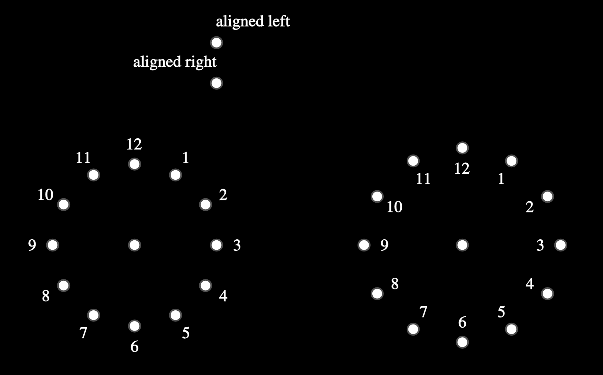

# EPoint

> [base methods and properties](./base_object_documentation.md)

```
def __init__(self, center, label, fill_color, radius, **kwargs):
```


## Arguments

| variable     | type                     | default    | description                                                  |
| ------------ | ------------------------ | ---------- | ------------------------------------------------------------ |
| `center`     | `mn.Vect3`               |            | the coordinates of the point                                 |
| `fill_color` | `mn.Color`               | `mn.White` | the width of the line outlining the object                   |
| `label`      | `str`, `tuple[str,dict]` | `None`     | Instead of using the method `add_label`, you can add a label here |
| `radius`     | `float`,                 | `mn_scale(7)`     | Radius of the circle indicating the point |
| `**kwargs`   |                          |            | Extra arguments for the animation                            |


## EPoint Properties

| Property      | type       | Description                               |
| ------------- | ---------- | ----------------------------------------- |
| `coordinates` | `mn.Vect3` | the coordinates of the start of the point |


## Label

### `add_label(self, text, direction, side, alpha, buff, align) -> ELine`

| name        | type                   | default      | description                                                  |
| ----------- | ---------------------- | ------------ | ------------------------------------------------------------ |
| `text`      | `str`                  |              | the string representation of the label                       |
| `direction` | ` mn.Vect3`            | `mn.UP`      | what direction do you want to put the label (up, down, right, left) (overides 'side' parameter).  Note that it goes in the direction based on the point calculated by `alpha`, and not 'up' of the line per se |
| `buff`      | `float`                | `LABEL_BUFF` | how far away from the line do you want the label             |
| `away_from` | `Callable[[],mn.Vect3]`, `mn.Vect3` | `None` | The label will be on the farther side from the away_from location.  If set, overides the `direction` argument and ignores the `towards` argument |
| `towards` | `Callable[[],mn.Vect3]`, `mn.Vect3`, | `None` | The label will be on the closer side from the away_from location.  If set, overides the `direction` argument |
| `align`     |                        | `mn.ORIGIN`  | which side to align the text to                              |

> **away_from**, and **towards** accept the following:
>
> * a function that returns a coordinate (`mn.Vect3`)
> * a coordinate (`mn.Vect3`)
> * an `mn.Object` where the center of that object will be used as the coordinates

_Example_: labels


```python
    p = EPoint(mn_coord(500,150)).add_label(r"\text{aligned left}", align=mn.LEFT)
    p = EPoint(mn_coord(500,200)).add_label(r"\text{aligned right}", align=mn.RIGHT)

    # center of clock
    p = EPoint(mn_coord(400,400))

    # labels on the outside, use 'away_from'= mn.Vect3
    for hour in range(1,13):
        xc,yc,_ = p.coordinates
        angle = (mn.PI/2 - mn.PI/6 * hour)%mn.TAU
        x = xc + mn_scale(100)*math.cos(angle)
        y = yc + mn_scale(100)*math.sin(angle)
        EPoint((x,y,0)).add_label(str(hour),away_from=[xc,yc,0])

    # center of clock
    p = EPoint(mn_coord(800,400))

    # labels on the inside, use 'towards'= mn.Object
    for hour in range(1,13):
        xc,yc,_ = p.coordinates
        angle = (mn.PI/2 - mn.PI/6 * hour)%mn.TAU
        x = xc + mn_scale(120)*math.cos(angle)
        y = yc + mn_scale(120)*math.sin(angle)
        EPoint((x,y,0)).add_label(str(hour),towards=p) 
```

## Class Methods

### `distance_between( cls, p1, p2)-> float`

calculates the distance between the two points

| name | type              | default | description                                      |
| ---- | ----------------- | ------- | ------------------------------------------------ |
| `p1` | `EPoint|mn.Vect3` |         | first point or coordinate                        |
| `p2` | `EPoint|mn.Vect3` |         | 2nd point or coordinate                          |


```python
from __future__ import annotations

import math
from typing import Iterable, Self, Callable

from euclidlib.Objects.em_object_base import EMObject
from euclidlib.Utilities.coordinate_utilities import  convert_to_coord, call_or_get
import manimlib as mn


def darken(colour: mn.ManimColor):
   return [
       mn.interpolate_color(color, mn.BLACK, 2/3)
       for color in mn.listify(colour)
   ]


# ================================================================================================================
# Point is just a manim circle
# ================================================================================================================
class EPoint(EMObject, mn.Circle):
    CONSTRUCTION_TIME=0.25
    LabelBuff = mn.MED_SMALL_BUFF

    # ----------------------------------------------------------------------------------------------------------------
    # initialize
    # ----------------------------------------------------------------------------------------------------------------
    def __init__(self, center, animate_part=None, *args, fill_color=mn.WHITE, radius=0.075, **kwargs):
        super().__init__(
            arc_center=convert_to_coord(center),
            radius=radius,
            stroke_color=darken(mn.GREY),
            stroke_width=2,
            fill_color=fill_color,
            fill_opacity=1.0,
            animate_part=['set_fill', 'set_stroke'] if animate_part is None else animate_part,
            *args,
            **kwargs)
        self.z_index += 2


    # ----------------------------------------------------------------------------------------------------------------
    # set the colour (not part of the user animation stuff, used by create_target,
    #                 which is used by manim during transformations)
    #                 which is used by manim during transformations)
    # ----------------------------------------------------------------------------------------------------------------
    def set_color(
            self,
            color: mn.ManimColor | Iterable[mn.ManimColor] | None,
            opacity: float | Iterable[float] | None = None,
            recurse: bool = True
    ) -> Self:
        self.set_fill(color, opacity=opacity, recurse=recurse)
        self.set_stroke(darken(color), opacity=opacity, recurse=recurse)
        return self

    # ----------------------------------------------------------------------------------------------------------------
    # get the point where the label should be drawn
    # ----------------------------------------------------------------------------------------------------------------
    # this is a callback routine from the lambda that is used for Label, to keep the label in the correct position
    # if this point is moved
    def e_label_location(self,
                         direction: mn.Vect3 = mn.UP,
                         buff: float = None,
                         *,
                         away_from: Callable[[], mn.Vect3] | float = None,
                         towards: Callable[[], mn.Vect3] | float = None,
                         ):
        center = self.get_arc_center()
        if away_from is not None:
            direction = mn.normalize(center - call_or_get(away_from))
        elif towards is not None:
            direction = mn.normalize(call_or_get(towards) - center)
        return center + direction * (buff or self.LabelBuff)

    # ----------------------------------------------------------------------------------------------------------------
    # get distance between this point, and an x,y,z position (always a positive number)
    # ----------------------------------------------------------------------------------------------------------------
    def distance_to(self, position: mn.Vect3) -> float:
        x0, y0, z0 = self.get_arc_center()
        x1, y1, z1 = position
        dx = x1 - x0
        dy = y1 - y0
        dz = z1 - z0
        return math.sqrt(dx**2 + dy**2 + dz**2)

    # ----------------------------------------------------------------------------------------------------------------
    # get distance between two points
    # ----------------------------------------------------------------------------------------------------------------
    @classmethod
    def distance_between(cls, p1: EPoint | mn.Vect3, p2: EPoint | mn.Vect3):
        x0, y0, z0 = convert_to_coord(p1)
        x1, y1, z1 = convert_to_coord(p2)
        dx = x1 - x0
        dy = y1 - y0
        dz = z1 - z0
        return math.sqrt(dx**2 + dy**2 + dz**2)

    # ----------------------------------------------------------------------------------------------------------------
    # highlight the point
    # ----------------------------------------------------------------------------------------------------------------
    def highlight(self, color=mn.RED, scale=2.0, **args):
        target = self.animate(rate_func=mn.there_and_back, **args)
        target.scale(scale)
        target.set_color(color)
        return target

    # ----------------------------------------------------------------------------------------------------------------
    # two points overlap - maybe used when interacting with mouse selection??
    # ----------------------------------------------------------------------------------------------------------------
    def intersect(self, other: mn.Mobject, reverse=True):
        if isinstance(other, mn.Rectangle):
            return self.intersect_selection(other)
        return super().intersect(other)

    # ----------------------------------------------------------------------------------------------------------------
    # is point touching a rectangle?
    # ----------------------------------------------------------------------------------------------------------------
    def intersect_selection(self, other: mn.Rectangle):
        return other.is_touching(self)

    # ----------------------------------------------------------------------------------------------------------------
    # coordinates
    # ----------------------------------------------------------------------------------------------------------------
    @property
    def coordinates(self):
        return convert_to_coord(self)

    def __str__(self):
        return f"Point: ({self.get_arc_center()[0]:6.2f},{self.get_arc_center()[1]:6.2f})"

class VirtualPoint(EPoint):
    Virtual = True
```

