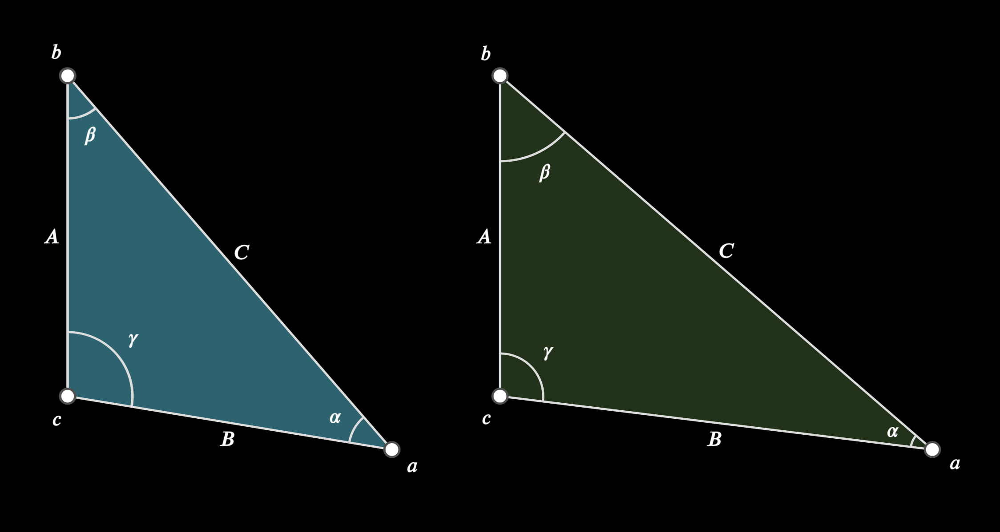
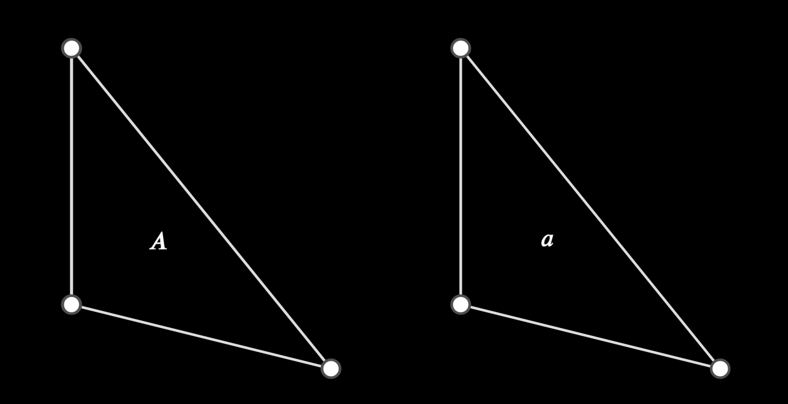
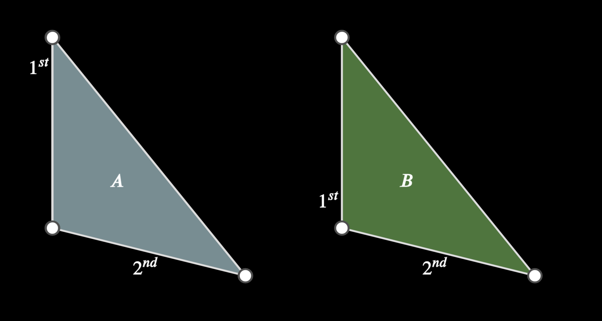
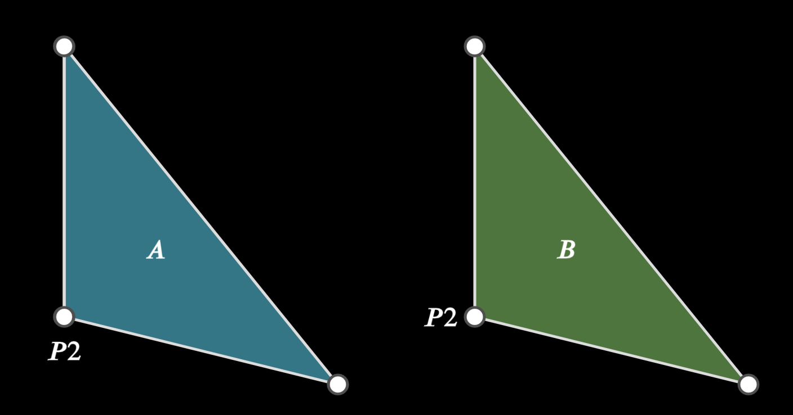
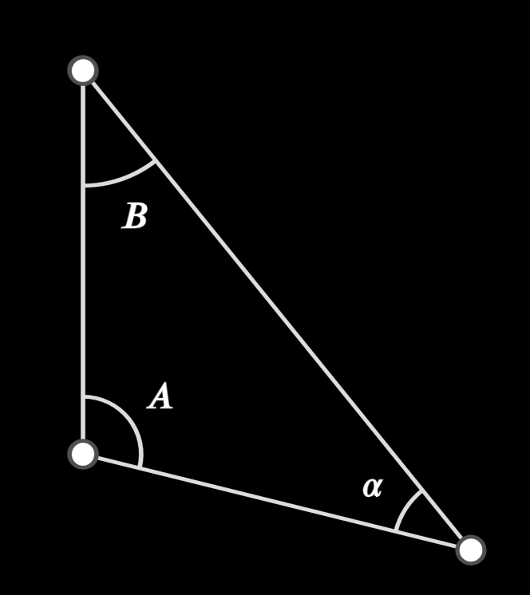
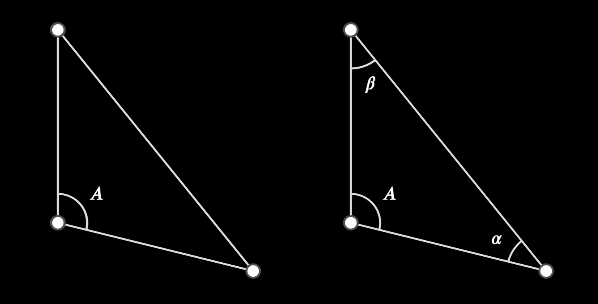
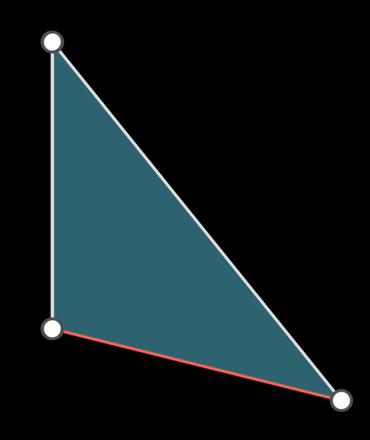
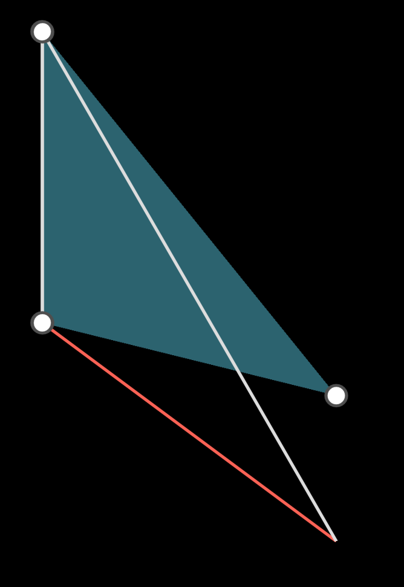

# EPolygonBase

> [base methods and properties](./base_object_documentation.md)

```
def __init__(self, *points, point_labels, labels, angles, fill, **kwargs);
```


## Arguments

| variable       | type                       | default | description                                                  |
| -------------- | -------------------------- | ------- | ------------------------------------------------------------ |
| `*points`      | `Point.EPoint, mn.Vect3`   |         | the coordinates or point for each polygon vertex             |
| `point_labels` | Iterable      | `None`  | an iterable describing valid point label options, one per point (see point_documentation for valid label arguments) |
| `label`       | `string` | `None`  | the polygon label (drawn inside the polygon) |
| `labels`       | Iterable      | `None`  | an iterable describing valid point label options, one per point (see point_documentation for valid label arguments) |
| `angles` | `tuple[str...]| tuple[tuple[str,float],...]` | `None`  | A list of angle labels, where a label can either be a string, or a pair with a text string followed by the radius of the angle to be drawn |
| `fill`         | `tuple[mn.Color|str,float`] | `None` | Either a color, or a tuple of color and opacity              |
| `speed`        | `float`                    | `None`  | How fast do you want the animation?                          |
| `**kwargs`     |                            |         | Extra arguments for the animation                            |

_Example:_



```python
    # angle radius size default is ANGLE_SIZE, 'None' size reverts to default size,
    p= EPolygon(mn_coord(100, 100), mn_coord(100, 400), mn_coord(400, 450),
             labels=['A', 'B', 'C'],
             point_labels=['b', 'c', 'a'],
             angles=[r'\beta', r'\gamma', r'\alpha', None, mn_scale(60)],
             fill=mn.BLUE
             )
    print([a*180/mn.PI for a in p.angle_values])

    # fill can be colour, or [colour, opacity]
    EPolygon(mn_coord(500, 100), mn_coord(500, 400), mn_coord(900, 450),
             labels=['A', 'B', 'C'],
             point_labels=['b', 'c', 'a'],
             angles=[r'\beta', r'\gamma', r'\alpha', ANGLE_SIZE * 2, None, ANGLE_SIZE / 2],
             fill=[mn.GREEN, 0.50]
             )
```


## EPolygonBase Properties

| Property       | type             | Description                                                  |
| -------------- | ---------------- | ------------------------------------------------------------ |
| `l`            | `list[ELine]`    | list of all the lines that make up the polygon               |
| `p`            | `list[EPoint]`   | list of all the points that make up the polygon              |
| `a`            | `list[EAngle]`   | list of all the angles that make up the polygon              |
| `v`            | `list[mn.Vect3]` | list of all the vertices (as coordinates) that make up the polygon |
| `angle_values` | `list[float]`    | a list of the angles values (in radians)                     |
| `area`         | `float`          | the area of the polygon                                      |


## Labels and Angles

The polygon itself has a label, independent from the line/point/angle labels

### `add_label(self, text) -> EPolygon`

| name        | type              | default                 | description                                                  |
| ----------- | ----------------- | ----------------------- | ------------------------------------------------------------ |
| `text`      | `str`             |                         | the string representation of the label                       |

_Example:_


```python
EPolygon(mn_coord(100, 100), mn_coord(100, 300), mn_coord(300, 350),label='A')
poly = EPolygon(mn_coord(400, 100), mn_coord(400, 300), mn_coord(600, 350))
poly.add_label("a")
```

### `add_line_labels(self, *labels) -> EPolygon`

Add labels to each of the polygon lines
> NOTE: The lines can be 
> * labelled individually by specify the sub-object _i.e._ `poly.l[3].add_label(...)`
> * the labels defined here can also be defined in the constructor with the key `labels`

| name      | type | default | description                                                  |
| --------- | ---- | ------- | ------------------------------------------------------------ |
| `*labels` |      |         | an iterable of valid label line arguments (see ELine for valid label options). Each `label` is assigned to the line in order, so the total number of `label`s does not have to be the same as the number of sides of the polygon |

_Example:_


```python
    poly = EPolygon(mn_coord(100, 100), mn_coord(100, 300), mn_coord(300, 350), label='A').e_fill(mn.BLUE_A)

    poly.add_line_labels([
        r'1^{st}',dict(buff=0.2*LABEL_BUFF,align=mn.RIGHT,alpha=.15)],  # line 1 label options
        r'2^{nd}')                                                      # line 2 label options

    EPolygon(mn_coord(400, 100), mn_coord(400, 300), mn_coord(600, 350),
                    label = 'B',
                    labels = [
                        [r'1^{st}',dict(buff=0.2*LABEL_BUFF,align=mn.RIGHT,alpha=.85)],
                        r'2^{nd}'
                    ]
                    ).e_fill(mn.GREEN)
```


### add_point_labels(self, *labels) -> EPolygon`

Add labels to each of the polygon points
> NOTE: The point can be 
> * labelled individually by specify the sub-object _i.e._ `poly.p[3].add_label(...)`
> * the labels defined here can also be defined in the constructor with the key `point_labels`


| name      | type | default | description                                                  |
| --------- | ---- | ------- | ------------------------------------------------------------ |
| `*labels` |      |         | an iterable of valid point line arguments (see EPoint for valid label options). Each `label` is assigned to a `point` in order, so the total number of `label`s does not have to be the same as the number of sides of the polygon |

_Example:_



```python
    poly = EPolygon(mn_coord(100, 100), mn_coord(100, 300), mn_coord(300, 350), label='A').e_fill(mn.BLUE)

    poly.set_point_labels(
         None,                               # point 1 label options
         ('P2', dict(direction=mn.DOWN)      # point 2 label options
         ),
    )

    EPolygon(mn_coord(400, 100), mn_coord(400, 300), mn_coord(600, 350),
                    label = 'B',
                    point_labels = [
                        None,
                        ('P2', dict(direction=mn.LEFT)),
                    ]
                    ).e_fill(mn.GREEN)

```


### `add_angles(self, *names, speed)->EPolygon`

draw the angles in the polygon, and label them (if desired). 

> * the angles defined here can also be defined in the constructor with the key `angles`
>
> the standard options for labelling the angles are _not_ available via this method.  If more control is required, apply the label to the angle object directly (i.e. `poly.a[0].add_label(...)`), assuming the angle already exists!!

| name    | type                    | default      | description                                                  |
| ------- | ----------------------- | ------------ | ------------------------------------------------------------ |
| `*names` | `str | tuple[str,float]` |        | one label for each angle, or a tuple describing the label & options |
| `sizes` | `Optional[list[Optional[float]]]` | `None`       | size (radius) of the arc denoting the angle, if size is not defined, then the default size is used (`ANGLE_SIZE`) |
| `speed`    | `float` | -1      | If `speed` is greater than zero it sets the speed of the animation used to calculate the midpoint, otherwise, only the EAngle will be drawn |
| `**kwargs` |         |         | animation arguments                                          |

_Example:_


```python
    poly = EPolygon(mn_coord(100, 100), mn_coord(100, 300), mn_coord(300, 350))
    poly.add_angles(r'\beta', None, r'\alpha')

    # add 'A' angle to the second vertex
    poly.add_angles(None,('A',ANGLE_SIZE*0.75),None)

    # rename the first angle to 'B' and change its size
    poly.add_angles(("B",ANGLE_SIZE*1.5), None, None)
```

### `remove_angles(self)`

Removes the angles from the screen (but the information is still stored elsewhere)

### `draw_angles(self)`

Redraw the angles (if they have been removed, they will be redrawn)

_Example_:


```python
    # create, remove and add
    poly = EPolygon(mn_coord(100, 100), mn_coord(100, 300), mn_coord(300, 350))
    poly.add_angles(r'\beta', None, r'\alpha')
    poly.remove_angles()
    poly.add_angles(None,('A',ANGLE_SIZE*0.75))

    # do same as above, but redraw afterwards
    poly = EPolygon(mn_coord(400, 100), mn_coord(400, 300), mn_coord(600, 350))
    poly.add_angles(r'\beta', None, r'\alpha')
    poly.remove_angles()
    poly.add_angles(None,('A',ANGLE_SIZE*0.75),None)

    poly.draw_angles()
```


## Class creation method

### `assemble(cls, lines, points, angles,**kwargs) -> Optional[EPolygon]:`

Build a polygon of existing objects.  

If no `Epoint` objects are specified, the vertices of the polygon will be computed using the `ELine` objects.  If it does not form a closed loop, no polygon will be created (returns `None`)

| variable       | type                       | default | description                                                  |
| -------------- | -------------------------- | ------- | ------------------------------------------------------------ |
| `lines` | `Optional[list[ELine]` | `None` | lines that define a polygon (if lines and points are given, points will be used and NOT the lines, although the lines will be saved) |
| `points` | `Optional[list[EPoint]]` | `None`  | points that define a polygon |
| `angles` | `Optional[list[EAngle]]` | `None`  | angle objects that are part of the polygon |
| `fill`         | `tuple[mn.Color|str,float`] | `None` | Either a color, or a tuple of color and opacity              |
| `**kwargs`     |                            |         | Extra arguments for the animation                            |

_Example:_ Modify line after polygon created


```python
    p1 = EPoint(mn_coord(100, 100))
    p2 = EPoint(mn_coord(100, 300))
    p3 = EPoint(mn_coord(300, 350))

    line1 = ELine(mn_coord(100, 100), mn_coord(100, 300))
    line2 = ELine(mn_coord(100, 300), mn_coord(300, 350))
    line3 = ELine(mn_coord(300, 350), mn_coord(100, 100))

    poly = EPolygon.assemble(points=[p1, p2, p3], lines=[line1, line2, line3]).e_fill(mn.BLUE)

    # line2 and poly[1] point to the same object
    line2.red()  # could also use poly[1].red()
```


_Example_: When lines and points don't match


```python
    p1=EPoint(mn_coord(100,100))
    p2=EPoint(mn_coord(100,300))
    p3=EPoint(mn_coord(300,350))

    line1 = ELine( mn_coord(100,100), mn_coord(100,300))
    line2 = ELine( mn_coord(100,300), mn_coord(300,450))
    line3 = ELine( mn_coord(300,450), mn_coord(100,100))

    poly = EPolygon.assemble(points=[p1,p2,p3],lines=[line1,line2,line3]).e_fill(mn.BLUE)
    poly.l[1].red()
```

## Methods

### `e_fill(self, color: mn.ManimColor = None, opacity=1)->EPolygon`

fill the polygon with the specified colour (and opacity)

### `e_unfill(self)`

remove the colour from the polygon

### `replace_point(index, point)`

remove the existing point stored as part of the polygon object and replace it with an existing point

_Example:_
```python
p =  EPoint(mn_coord(100, 100)).add_label("A").red()
poly = EPolygon(mn_coord(100, 100), mn_coord(100, 300), mn_coord(300, 350))
poly.replace_point(0,p)
```

### `replace_line(index, point)`

remove the existing line stored as part of the polygon object and replace it with an existing line

_Example_:

```python
    l =  ELine(mn_coord(100, 100),mn_coord(100, 300)).dash()
    poly = EPolygon(mn_coord(100, 100), mn_coord(100, 300), mn_coord(300, 350))
    poly.replace_line(0,l)

```


### `move_point_to(self, index, dest)`

Modify the shape of the polygon by moving a point from its current location to a new location

| name    | type                    | default      | description                                                  |
| ------- | ----------------------- | ------------ | ------------------------------------------------------------ |
| `index` | `int` |        | Index of point to move |
| `dest` | `EPoint | mn.Vect3` |        | where to? |

_Example:_ 
<video controls width="300" height="200" poster="placeholder_image.png">
    <source src="./images/polygon_move_point_to.mp4" type="video/mp4">
</video>


```python
    p_other = EPoint(mn_coord(50, 50))
    poly = EPolygon(mn_coord(100, 100), mn_coord(100, 300), mn_coord(300, 350)).blue()
    poly.move_point_to(0, p_other)
```

