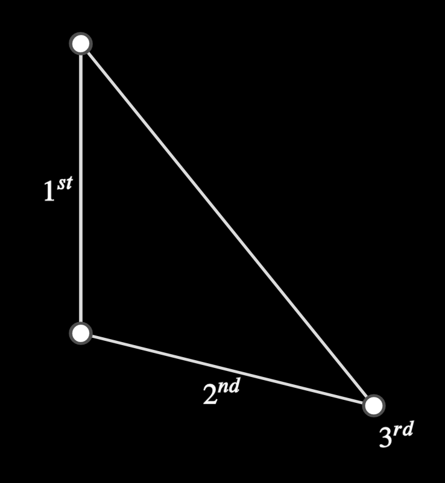
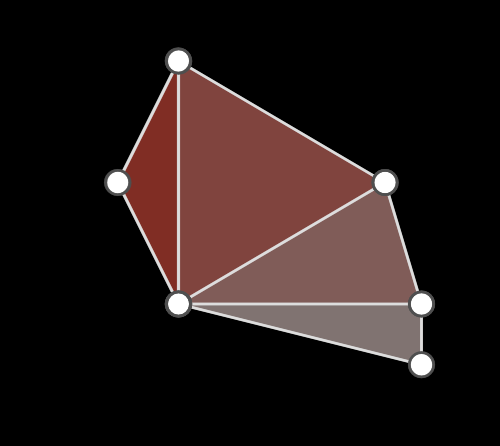

# EPolygon

> [base methods and properties](./base_object_documentation.md)

```
def __init__(self, *points, point_labels, labels, angle_info, fill, **kwargs);
```


## Arguments

| variable       | type                       | default | description                                                  |
| -------------- | -------------------------- | ------- | ------------------------------------------------------------ |
| `*points`      | `Point.EPoint, mn.Vect3`   |         | the coordinates or point for each polygon vertex             |
| `point_labels` | _complicated_              | `None`  | a list or tuples describing valid point label options, one per point (see point_documentation for valid label arguments) |
| `labels`       | _complicated_              | `None`  | a list or tuples describing valid point label options, one per point (see point_documentation for valid label arguments) |
| `angle_info`   | `tuple[str,...,float,...]` | `None`  | A list of angle label strings, followed by (optional) the radius of the angle indicators |
| `fill`         | `tuple[mn.Color|str,float`] | `None` | Either a color, or a tuple of color and opacity              |
| `speed`        | `float`                    | `None`  | How fast do you want the animation?                          |
| `**kwargs`     |                            |         | Extra arguments for the animation                            |

_Example:_


```python
    # angle radius size default is ANGLE_SIZE, 'None' size will use default size,
    EPolygon(mn_coord(100, 100), mn_coord(100, 400), mn_coord(400, 450),
             labels=['A', 'B', 'C'],
             point_labels=['b', 'c', 'a'],
             angle_info=[r'\beta', r'\gamma', r'\alpha', None, mn_scale(60)],
             fill=mn.BLUE
             )

    # fill can be colour, or [colour, opacity]
    EPolygon(mn_coord(500, 100), mn_coord(500, 400), mn_coord(900, 450),
             labels=['A', 'B', 'C'],
             point_labels=['b', 'c', 'a'],
             angle_info=[r'\beta', r'\gamma', r'\alpha', ANGLE_SIZE * 2, None, ANGLE_SIZE / 2],
             fill=[mn.GREEN, 0.50]
             )
```


## EPolygon Properties

| Property       | type             | Description                                                  |
| -------------- | ---------------- | ------------------------------------------------------------ |
| `l`            | `list[ELine]`    | list of all the lines that make up the polygon               |
| `p`            | `list[EPoint]`   | list of all the points that make up the polygon              |
| `a`            | `list[EAngle]`   | list of all the angles that make up the polygon              |
| `v`            | `list[mn.Vect3]` | list of all the vertices (as coordinates) that make up the polygon |
| `angle_values` | `list[float]`    | a list of the angles values (in radians)                     |

    @property
    def angle_values(self):
        if not hasattr(self, '_angle_values'):
            self._calculate_angle_values()
        return self._angle_values
    
    @property
    def is_clockwise(self):
        if not hasattr(self, '_is_clockwise'):
            self._calculate_angle_values()
        return self._is_clockwise

## Class creation method

### `assemble(cls, lines, points, angles,**kwargs) -> Optional[EPolygon]:`

Build a polygon of existing objects.  

If no `Epoint` objects are specified, the vertices of the polygon will be computed using the `ELine` objects.  If it does not form a closed loop, no polygon will be created (returns `None`)

| variable       | type                       | default | description                                                  |
| -------------- | -------------------------- | ------- | ------------------------------------------------------------ |
| `lines` | `Optional[list[ELine]` | `None` | lines that define a polygon (if lines and points are given, points will be used and NOT the lines, although the lines will be saved) |
| `points` | `Optional[list[EPoint]]` | `None`  | points that define a polygon |
| `angles` | `Optional[list[EAngle]]` | `None`  | angle objects that are part of the polygon |
| `fill`         | `tuple[mn.Color|str,float`] | `None` | Either a color, or a tuple of color and opacity              |
| `**kwargs`     |                            |         | Extra arguments for the animation                            |

_Example:_ Modify line after polygon created


```python
    p1 = EPoint(mn_coord(100, 100))
    p2 = EPoint(mn_coord(100, 300))
    p3 = EPoint(mn_coord(300, 350))

    line1 = ELine(mn_coord(100, 100), mn_coord(100, 300))
    line2 = ELine(mn_coord(100, 300), mn_coord(300, 350))
    line3 = ELine(mn_coord(300, 350), mn_coord(100, 100))

    poly = EPolygon.assemble(points=[p1, p2, p3], lines=[line1, line2, line3]).e_fill(mn.BLUE)

    # line2 and poly[1] point to the same object
    line2.red()  # could also use poly[1].red()
```


_Example_: When lines and points don't match


```python
    p1=EPoint(mn_coord(100,100))
    p2=EPoint(mn_coord(100,300))
    p3=EPoint(mn_coord(300,350))

    line1 = ELine( mn_coord(100,100), mn_coord(100,300))
    line2 = ELine( mn_coord(100,300), mn_coord(300,450))
    line3 = ELine( mn_coord(300,450), mn_coord(100,100))

    poly = EPolygon.assemble(points=[p1,p2,p3],lines=[line1,line2,line3]).e_fill(mn.BLUE)
    poly.l[1].red()
```


## Labels

EPolygon does not have a label.  

The lines, points and angles can be 

* labelled individually by specify the sub-object _i.e._ `poly.l[3].add_label(...)`, or
* as a group `add_labels(...)`, `add_point_labels(...)`

_Example:_


```python
    poly = EPolygon(mn_coord(100, 100), mn_coord(100, 300), mn_coord(300, 350))

    poly.set_labels(r'1^{st}',r'2^{nd}')
    poly.set_point_labels(
         None,
         None,
         (r'3^{rd}', dict(away_from=poly)
         ),
    )
```

## Methods

### `e_fill(self, color: mn.ManimColor = None, opacity=1)->EPolygon`

fill the polygon with the specified colour (and opacity)

### `e_unfill(self)`

remove the colour from the polygon

### `replace_point(index, point)`

remove the existing point stored as part of the polygon object and replace it with an existing point

_Example:_
```python
p =  EPoint(mn_coord(100, 100)).add_label("A").red()
poly = EPolygon(mn_coord(100, 100), mn_coord(100, 300), mn_coord(300, 350))
poly.replace_point(0,p)
```

### `replace_line(index, point)`

remove the existing line stored as part of the polygon object and replace it with an existing line

_Example_:

```python
    l =  ELine(mn_coord(100, 100),mn_coord(100, 300)).dash()
    poly = EPolygon(mn_coord(100, 100), mn_coord(100, 300), mn_coord(300, 350))
    poly.replace_line(0,l)

```

### set_angles(self, names, sizes, speed)->EPolygon`

draw the angles in the polygon, and label them (if desired). 

> the standard options for labelling the angles are _not_ available via this method.  If more control is required, apply the label to the angle object directly (i.e. `poly.a[0].add_label(...)`)

| name    | type                    | default      | description                                                  |
| ------- | ----------------------- | ------------ | ------------------------------------------------------------ |
| `names` | `list[Optional[str]]`   |        | one label for each line, in order. if the `name` is `None`, then any pre-existing angle will not be modified, nor will a new one be created |
| `sizes` | `Optional[list[Optional[float]]]` | `None`       | size (radius) of the arc denoting the angle, if size is not defined, then the default size is used (`ANGLE_SIZE`) |
| `speed`    | `float` | -1      | If `speed` is greater than zero it sets the speed of the animation used to calculate the midpoint, otherwise, only the EAngle will be drawn |
| `**kwargs` |         |         | animation arguments                                          |

_Example:_


```python
    poly = EPolygon(mn_coord(100, 100), mn_coord(100, 300), mn_coord(300, 350))
    poly.set_angles((r'\beta', None, r'\alpha'))

    # add 'A' angle to the second vertex
    poly.set_angles((None,'A',None), (None, ANGLE_SIZE*0.75))

    # rename the first angle to 'B' and change its size
    poly.set_angles(("B", None, None), (ANGLE_SIZE*1.5, ))
```

### `remove_angles(self)`

Removes the angles from the screen (but the information is still stored elsewhere)

### `draw_angles(self)`

Redraw the angles (if they have been removed, they will be redrawn)

_Example_:


```python
    # create, remove and add
    poly = EPolygon(mn_coord(100, 100), mn_coord(100, 300), mn_coord(300, 350))
    poly.set_angles((r'\beta', None, r'\alpha'))
    poly.remove_angles()
    poly.set_angles((None,'A',None), (None, ANGLE_SIZE*0.75))

    # do same as above, but redraw afterwards
    poly = EPolygon(mn_coord(400, 100), mn_coord(400, 300), mn_coord(600, 350))
    poly.set_angles((r'\beta', None, r'\alpha'))
    poly.remove_angles()
    poly.set_angles((None,'A',None), (None, ANGLE_SIZE*0.75))
    ##########
    poly.draw_angles()

```

### `move_point_to(self, index, dest)`

Modify the shape of the polygon by moving a point from its current location to a new location

| name    | type                    | default      | description                                                  |
| ------- | ----------------------- | ------------ | ------------------------------------------------------------ |
| `index` | `int` |        | Index of point to move |
| `dest` | `EPoint | mn.Vect3` |        | where to? |

_Example:_ 
<video controls width="300" height="200" poster="placeholder_image.png">
    <source src="./images/polygon_move_point_to.mp4" type="video/mp4">
</video>


```python
    p_other = EPoint(mn_coord(50, 50))
    poly = EPolygon(mn_coord(100, 100), mn_coord(100, 300), mn_coord(300, 350)).blue()
    poly.move_point_to(0, p_other)
```


## Construction Methods

### `copy_to_triangles(self) -> list[ETriangle]`

creates a series of triangles that completely covers the given polygon

| name    | type                    | default      | description                                                  |
| ------- | ----------------------- | ------------ | ------------------------------------------------------------ |
| `**kwargs` |         |         | animation arguments                                          |

_Example_:


```python
	from euclidlib.Utilities import Colour
    poly = EPolygon(mn_coord(200, 200), mn_coord(150,300), mn_coord(200, 400), mn_coord(400,450), mn_coord(400, 400), mn_coord(370,300))
    triangles = poly.copy_to_triangles()
    colour = Colour.string("misty rose")
    for t in triangles:
        t.e_fill(colour)
        colour = Colour.darken(colour)
```

### `copy_to_parallelogram_on_line(self, line, angle)`

create a new parallelogram that is the same area as this polygon, where one side of the parallelogram is congruent with `line` and the defining angle of the parallelogram will be `angle`

| name    | type                    | default      | description                                                  |
| ------- | ----------------------- | ------------ | ------------------------------------------------------------ |
| `line` | `ELine` |         | the line to draw the parallelogram on      |
| `angle` | `EAngleBase` |         | the angle used to define the angle of the parallelogram |
| `speed`    | `float` | -1      | If `speed` is greater than zero it sets the speed of the animation used to calculate the midpoint, otherwise, only the EPoint will be drawn |
| `**kwargs` |         |         | animation arguments                                          |


```python

    @log
    @copy_transform()
    def copy_to_parallelogram_on_point(self, point: Point.EPoint, angle: Angle.EAngleBase, /, negative=False):
        coords = convert_to_coord(point)
        line = Line.ELine(coords, coords + mn_scale(200 if not negative else -200, 0, 0))
        print("speed", self.speed)
        para = self.copy_to_parallelogram_on_line(line, angle, speed=0)
        line.e_remove()
        return para

    @log
    @copy_transform()
    def copy_to_parallelogram_on_line(self, line: Line.ELine, angle: Angle.EAngleBase):
        # ------------------------------------------------------------------------
        # get a list of triangles that make up the polygon
        # ------------------------------------------------------------------------
        print("speed", self.speed)
        triangles = self.copy_to_triangles()

        # ------------------------------------------------------------------------
        # convert each triangle to a parallelogram
        # ------------------------------------------------------------------------
        parallels = []

        current_line = line.copy()
        coords = current_line.get_start_and_end()
        for tri in triangles:
            tri.e_fill(mn.RED)
            parallels.append(tri.copy_to_parallelogram_on_line(current_line, angle))

            with self.scene.simultaneous():
                parallels[-1].e_draw()
                tri.e_remove()
            current_line.e_delete()
            current_line = Line.ELine(*reversed(parallels[-1].l[2].get_start_and_end()),
                                   skip_anim=True,
                                   stroke_color=mn.RED)
        current_line.e_delete()
        from . import Parallelogram as Para
        poly = Para.EParallelogram(*coords, *reversed(current_line.get_start_and_end()))
        with self.scene.simultaneous():
            for x in parallels:
                x.e_remove()
        return poly


    @log
    @copy_transform()
    def copy_to_rectangle(self, point: EMObject | mn.Vect3):
        # need a right angle
        with self.scene.simultaneous():
            l1 = Line.ELine(mn.LEFT, mn.ORIGIN).e_fade()
            l2 = Line.ELine(mn.LEFT, mn.UL).e_fade()
        right = Angle.EAngle(l1, l2)
        with self.scene.simultaneous():
            l1.e_remove()
            l2.e_remove()

        # create parallelogram
        pll = self.copy_to_parallelogram_on_point(point, right, speed=0)
        right.e_remove()

        # - points might not be exactly square, due to round offs, or slight
        #   misalignment, so fix it.
        p = pll.vertices
        p[2][0] = p[1][0]
        p[3][0] = p[0][0]
        p[1][1] = p[0][1]
        p[3][1] = p[2][1]

        rect = EPolygon(*p, delay_anim=True)
        self.scene.play(mn.ReplacementTransform(pll, rect))
        return rect

    @log
    @copy_transform()
    def copy_to_similar_shape(self, line: Line.ELine):
        from . import Triangle as Tri
        # array of points for new polygon
        first_vec = self.l0.get_unit_vector()
        ref_line = line.get_unit_vector()

        if np.dot(first_vec, ref_line) >= 0:
            points: list[Point.EPoint] = [Point.EPoint(line.get_start()), Point.EPoint(line.get_end())]
        else:
            points: list[Point.EPoint] = [Point.EPoint(line.get_end()), Point.EPoint(line.get_start())]

        # --------------------------------------------------------------------------
        # create individual triangles and copy them
        # --------------------------------------------------------------------------
        line_to_draw_on = Line.ELine(*points, skip_anim=True).red()
        for third_point in self.p[2:]:
            # create new triangle
            t = Tri.ETriangle(self.p0, self.p1, third_point, fill=(mn.PINK, 0.5))

            # create two new angles
            with self.scene.simultaneous():
                a1 = Angle.EAngle(t.l0, t.l2)
                a2 = Angle.EAngle(t.l1, t.l0)

            # copy these angles to the line to draw on
            with self.scene.simultaneous():
                pt1 = Point.EPoint(line_to_draw_on.get_start())
                pt2 = Point.EPoint(line_to_draw_on.get_end())
            with self.scene.simultaneous():
                l1, a1tmp = a1.copy_to_line(pt1, line_to_draw_on)
                l2, a2tmp = a2.copy_to_line(pt2, line_to_draw_on, negative=True)

            # find the intersection of the new lines
            pt3 = Point.EPoint(l1.intersect_line(l2)[0])
            points.append(pt3)

            # clean up
            with self.scene.simultaneous():
                t.e_remove()
                a1.e_remove()
                a2.e_remove()
                l1.e_remove()
                l2.e_remove()
                a1tmp.e_remove()
                a2tmp.e_remove()
                pt1.e_remove()
                pt2.e_remove()
            # if third_point is not self.p[-1]:
            #     line_to_draw_on = Line.ELine(pt1, pt3).red()

        line_to_draw_on.e_remove()
        poly = EPolygon.assemble(points=points)
        return poly

    @log
    @copy_transform()
    def copy_to_polygon_shape(self, point: EMObject | mn.Vect3, poly: EPolygon):
        # need a right angle
        l1 = Line.VirtualLine(mn_coord(10, 40), mn_coord(40, 40))
        l2 = Line.VirtualLine(mn_coord(10, 40), mn_coord(10, 10))
        right = Angle.EAngle(l1, l2, delay_anim=True)

        # Create a rectangle equal in area to other BCLE (I.45)
        # drawn on it's base
        t1 = poly.copy_to_parallelogram_on_line(poly.l0, right)

        # copy self to rectangle alongside of previous CFME
        if self.is_clockwise == t1.is_clockwise:
            t2 = self.copy_to_parallelogram_on_line(t1.l1, right)
        else:
            t2 = self.copy_to_parallelogram_on_line(t1.l3, right)
        t2.blue()

        # create a line GH (starting at point $pt) such that it is
        # the mean proportional of BC, CF (VI.13)
        line3 = Line.ELine.mean_proportional(t1.l0, t2.l1, point, 0)

        # finally, draw a copy of the polygon onto the new line
        # (the final polygon will be the size of self, but similar to polygon)
        final = poly.copy_to_similar_shape(line3)

        # cleanup
        with self.scene.simultaneous():
            t1.e_remove()
            t2.e_remove()
            line3.e_remove()

        return final

    def reposition(self, *new_coords, anim=False):
        assert (len(self.points) == len(new_coords))
        new_poly = EPolygon(*new_coords, **self.options, delay_anim=True)
        if anim:
            self.scene.play(self.transform_to(new_poly, anim=mn.ReplacementTransform))
        else:
            self.scene.remove(*self.get_e_family())
        self.lines = new_poly.lines
        self.angles = new_poly.angles
        self.points = new_poly.points
        self.become(new_poly)
        self.scene.add(*self.get_e_family())
        if anim:
            self.scene.remove(new_poly)


```

