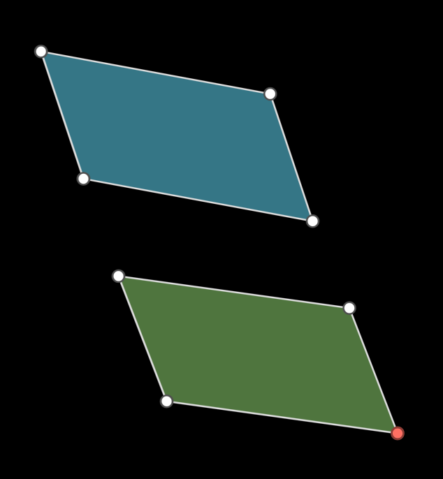

# EParallelogram

> [emobject base methods and properties](./base_object_documentation.md)
> [polygon base methods and properties](./polygon_base_documentation.md)
> [polygon methods and properties](./polygon_polygon_documentation.md)


## Arguments

| variable   | type                     | default | description                               |
| ---------- | ------------------------ | ------- | ----------------------------------------- |
| `*points`  | `Point.EPoint, mn.Vect3` |         | either 3 or 4 points of the parallelogram |
| `**kwargs` |                          |         | Arguments passed to EPolygon              |

```python
    p = EParallelogram(mn_coord(130,400),mn_coord(400,450),mn_coord(350,300))
```


## Class Methods

### `copy_to_line(cls, line) -> EParallelogram:`

Create a Triangle with 1st and 3rd side defined, with the angle defined

> NOTE: the triangle will always be drawn such that the second line will be  horizontal


| variable   | type    | default | description                                                  |
| ---------- | ------- | ------- | ------------------------------------------------------------ |
| `line`     | `ELine` |         | the line to copy the parallelogram to (the parallelogram will use this line as its base) |
| `speed`    | `float` | -1      | If greater than zero, animates the construction steps, otherwise just draws the new Parallelogram |
| `**kwargs` |         |         | Animation arguments                                          |

https://github.com/user-attachments/assets/4341338c-f644-4a77-a5e4-c9f8c91d586e

<video controls width="300" height="200" poster="placeholder_image.png">
    <source src="./images/parallelogram_copy_to_line.mp4" type="video/mp4">
</video>


```python
    p = EParallelogram(mn_coord(130,400),mn_coord(400,450),mn_coord(350,300)).e_fill(mn.BLUE)
    line = ELine(mn_coord(150,700),mn_coord(500,700))
    new = p.copy_to_line(line,speed=5)
    new.e_fill(mn.GREEN)

    p = EParallelogram(mn_coord(530,400),mn_coord(800,450),mn_coord(750,300)).e_fill(mn.BLUE)
    line = ELine(mn_coord(550,700),mn_coord(900,700))
    new = p.copy_to_line(line)
    new.e_fill(mn.GREEN)
```


### `copy_to_point(point)->EParallelogram`

| variable   | type    | default | description                                                  |
| ---------- | ------- | ------- | ------------------------------------------------------------ |
| `point`     | `EPoint` |         | one corner of the parallelogram |
| `speed`    | `float` | -1      | If greater than zero, animates the construction steps, otherwise just draws the new Parallelogram |
| `**kwargs` |         |         | Animation arguments                                          |


_Example:_


```python
    p = EParallelogram(mn_coord(130,400),mn_coord(400,450),mn_coord(350,300)).e_fill(mn.BLUE)
    point = EPoint(mn_coord(500,700)).red()
    new = p.copy_to_point(point, speed=5)
    new.e_fill(mn.GREEN)
    point.lift()
```

