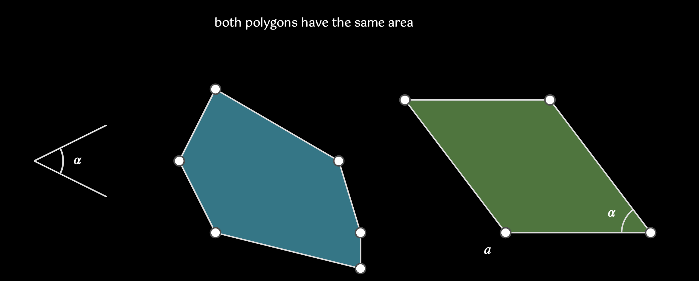
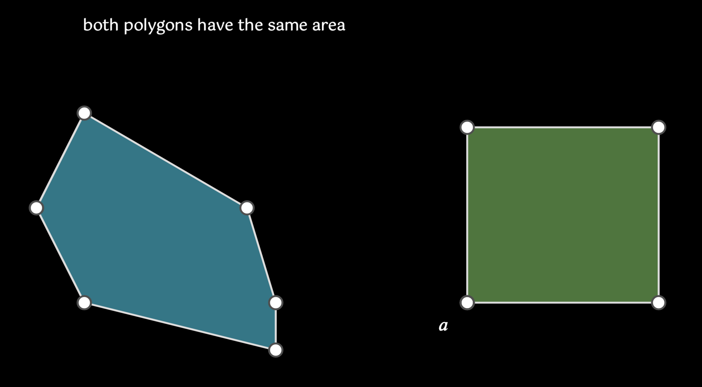

# EPolygon

> [emobject base methods and properties](./base_object_documentation.md)
> [polygon base methods and properties](./polygon_documentation.md)

## Construction Methods

### `copy_to_triangles(self) -> list[ETriangle]`

creates a series of triangles that completely covers the given polygon

| name       | type | default | description         |
| ---------- | ---- | ------- | ------------------- |
| `**kwargs` |      |         | animation arguments |

_Example_:


```python
	from euclidlib.Utilities import Colour
    poly = EPolygon(mn_coord(200, 200), mn_coord(150,300), mn_coord(200, 400), mn_coord(400,450), mn_coord(400, 400), mn_coord(370,300))
    triangles = poly.copy_to_triangles()
    colour = Colour.string("misty rose")
    for t in triangles:
        t.e_fill(colour)
        colour = Colour.darken(colour)
```

### `copy_to_parallelogram_on_line(self, line, angle) -> EPolygon`

create a new parallelogram that is the same area as this polygon, where one side of the parallelogram is congruent with `line` and the defining angle of the parallelogram will be `angle`

| name       | type         | default | description                                                  |
| ---------- | ------------ | ------- | ------------------------------------------------------------ |
| `line`     | `ELine`      |         | the line to draw the parallelogram on                        |
| `angle`    | `EAngleBase` |         | the angle used to define the angle of the parallelogram      |
| `speed`    | `float`      | -1      | If `speed` is greater than zero it sets the speed of the animation used to calculate the midpoint, otherwise, only the EPoint will be drawn |
| `**kwargs` |              |         | animation arguments                                          |

_Example:_


https://github.com/user-attachments/assets/ec17fdeb-2e3f-46ef-b35d-61defc4ca5c2


<video controls width="300" height="200" poster="placeholder_image.png">
    <source src="./images/polygon_parallelogram_line.mp4" type="video/mp4">
</video>

```python
    # create angle
    l2 = ELine(mn_coord(50,300), mn_coord(150,350))
    l3 = ELine(mn_coord(50,300), mn_coord(150,250))
    angle = EAngle(l2,l3,label=r'\alpha')

    # create parallelogram with intermediate animation
    poly = EPolygon(mn_coord(300, 200), mn_coord(250,300), mn_coord(300, 400), mn_coord(500,450), mn_coord(500, 400),
                    mn_coord(470,300))
    l1 = ELine(mn_coord(300,700), mn_coord(500,700),label='a')
    poly.copy_to_parallelogram_on_line(l1,angle, speed=2)

    # create parallelogram no intermediate animation
    poly = EPolygon(mn_coord(600, 200), mn_coord(550,300), mn_coord(600, 400), mn_coord(800,450), mn_coord(800, 400),
                    mn_coord(770,300))
    l1 = ELine(mn_coord(600,700), mn_coord(800,700),label='a')
    poly.copy_to_parallelogram_on_line(l1,angle)
```

### `copy_to_parallelogram_on_point(self, point, angle, /, negative=False))->EPolygon`

| name       | type         | default | description                                                  |
| ---------- | ------------ | ------- | ------------------------------------------------------------ |
| `point`    | `EPoint      |         | the point to draw the parallelogram on                        |
| `angle`    | `EAngleBase` |         | the angle used to define the angle of the parallelogram      |
| `negative` | `bool``      |`False`  | if true, the pt will be at the top right of the polygon, else it will be the bottom left      |
| `speed`    | `float`      | -1      | If `speed` is greater than zero it sets the speed of the animation used to calculate the midpoint, otherwise, only the EPoint will be drawn |
| `**kwargs` |              |         | animation arguments                                          |

_Example:_


```python
    t1 = TextBox(mn_coord(300,100))
    t1.explain(r"both polygons have the same area")

    l2 = ELine(mn_coord(50,300), mn_coord(150,350))
    l3 = ELine(mn_coord(50,300), mn_coord(150,250))
    angle = EAngle(l2,l3,label=r'\alpha')

    poly = EPolygon(mn_coord(300, 200), mn_coord(250,300), mn_coord(300, 400), mn_coord(500,450), mn_coord(500, 400),
                    mn_coord(470,300)).e_fill(mn.BLUE)
    p1 = EPoint( mn_coord(700,400),label=('a',mn.DL))
```

### `copy_to_rectangle(self, point)->EPolygon`
Create a rectangle that has the same area as the polygon
| name       | type         | default | description                                                  |
| ---------- | ------------ | ------- | ------------------------------------------------------------ |
| `point`    | `EPoint      |         | the point to draw the parallelogram on                        |
| `speed`    | `float`      | -1      | If `speed` is greater than zero it sets the speed of the animation used to calculate the midpoint, otherwise, only the EPoint will be drawn |
| `**kwargs` |              |         | animation arguments                                          |

_Example:_


```python
    t1 = TextBox(mn_coord(300,100))
    t1.explain(r"both polygons have the same area")
    poly = EPolygon(mn_coord(300, 200), mn_coord(250,300), mn_coord(300, 400), mn_coord(500,450), mn_coord(500, 400),
                    mn_coord(470,300)).e_fill(mn.BLUE)
    p1 = EPoint( mn_coord(700,400),label=('a',mn.DL))
    p2 = poly.copy_to_rectangle(p1)
    p2.e_fill(mn.GREEN)
```


### `copy_to_similar_shape(self, line)->EPolygon`

create a new parallelogram that is similar in shape to the original, and the 1st 

| name       | type         | default | description                                                  |
| ---------- | ------------ | ------- | ------------------------------------------------------------ |
| `line`     | `ELine`      |         | the line to draw the parallelogram on                        |
| `speed`    | `float`      | -1      | If `speed` is greater than zero it sets the speed of the animation used to calculate the midpoint, otherwise, only the EPoint will be drawn |
| `**kwargs` |              |         | animation arguments                                          |

_Example:_


https://github.com/user-attachments/assets/20789ad0-eaa5-4b05-986c-8a3449cb5b28

<video controls width="300" height="200" poster="placeholder_image.png">
    <source src="./images/polygon_copy_to_similar.mp4" type="video/mp4">
</video>

```python
    # create polygon
    poly = EPolygon(mn_coord(300, 200), mn_coord(250,300), mn_coord(300, 400), mn_coord(500,450), mn_coord(500, 400),
                    mn_coord(470,300))

    # create line to draw
    p0 = mn_coord(600, 200)
    p1 = p0 + 0.75*poly.l[0].get_length()*poly.l[0].get_unit_vector()
    l1 = ELine(p0,p1,label='a')

    # copy to line animating intermediate steps
    poly.copy_to_similar_shape(l1, speed=2)

    # create line to draw
    p0 = mn_coord(900, 200)
    p1 = p0 + 0.75 * poly.l[0].get_length() * poly.l[0].get_unit_vector()
    l1 = ELine(p0, p1, label='a')

    # copy to line without animating intermediate steps
    poly.copy_to_similar_shape(l1)
```

### `copy_to_polygon_shape(self, point, poly)->EPolygon`

Create a new polygon which is similar to the polygon passed as a parameter, but it will have the same area as the original polygon (self). 

| name       | type         | default | description                                                  |
| ---------- | ------------ | ------- | ------------------------------------------------------------ |
| `point`    | `EPoint`     |         | location to draw new polygon.                                |
| `poly`     | `EPolygon`   |         | the shape of the new polygon will be defined by this polygon |
| `speed`    | `float`      | -1      | If `speed` is greater than zero it sets the speed of the animation used to calculate the midpoint, otherwise, only the EPoint will be drawn |
| `**kwargs` |              |         | animation arguments                                          |

_Example:_
<video controls width="300" height="200" poster="placeholder_image.png">

https://github.com/user-attachments/assets/e6f40cb1-267d-464d-9d24-57cf19b56ea7

    <source src="./images/polygon_copy_to_polygon.mp4" type="video/mp4">
</video>

```python
    t1 = TextBox(mn_coord(300,100))
    t1.math(r"A_a = A_c\quad\quad b\sim c")

    p = EPoint(mn_coord(700, 400))

    # create polygon 1
    poly1 = EPolygon(mn_coord(200, 200), mn_coord(150,300), mn_coord(200, 400), mn_coord(400,450), mn_coord(400, 400),
                    mn_coord(370,300)).e_fill(mn.BLUE).add_label("a")

    # create polygon 2
    poly2 = EPolygon(mn_coord(500, 200), mn_coord(500, 400),  mn_coord(550, 400), mn_coord(600,300),
                     ).e_fill(mn.GREEN).add_label("b")

    poly1.copy_to_polygon_shape(p, poly2).e_fill(Colour.add(mn.BLUE, mn.GREEN)).add_label('c')

```


