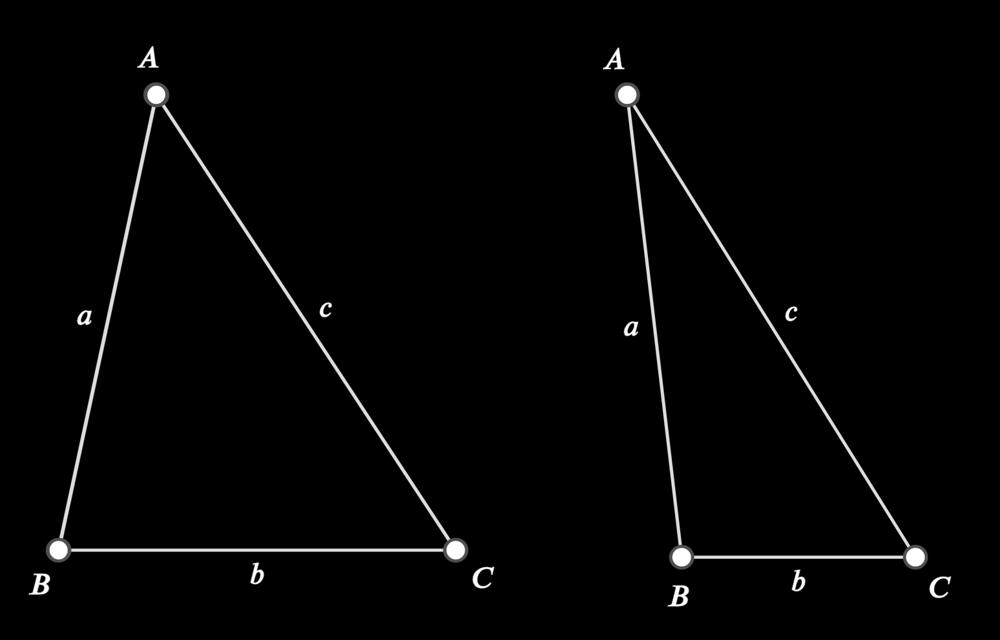
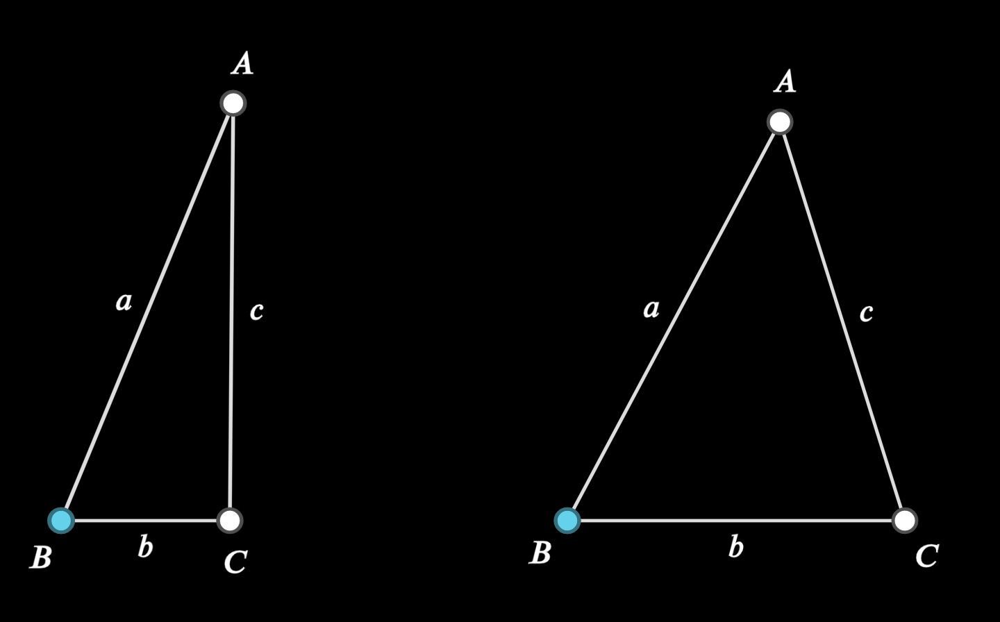
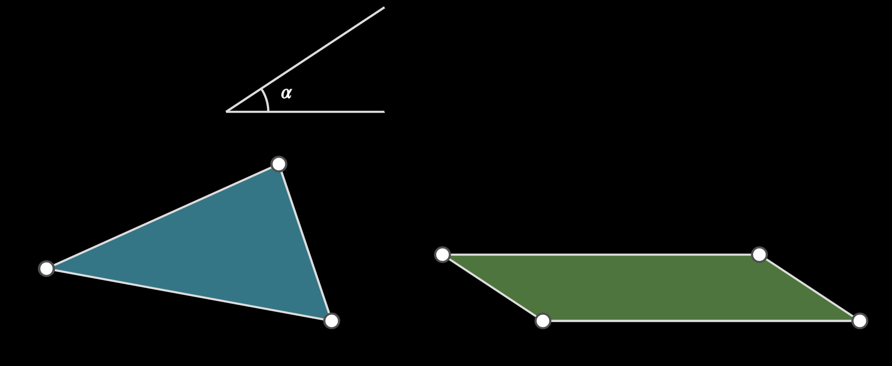

# ETriangle

> [emobject base methods and properties](./base_object_documentation.md)
> [polygon base methods and properties](./polygon_documentation.md)


## Class Methods

### `SAS(cls, point, side1, angle, side3, labels, point_labels) -> ETriangle:`

Create a Triangle with 1st and 3rd side defined, with the angle defined

> NOTE: the triangle will always be drawn such that the second line will be  horizontal


| variable       | type                       | default | description                                                  |
| -------------- | -------------------------- | ------- | ------------------------------------------------------------ |
| `point`        | `mn.Vect3 | EPoint`        |         | starting coordinate of the triangle (top point)              |
| `side1`        | `float`                    |         | length of side one                                           |
| `angle`        | `float`                    |         | value of angle in radians                                    |
| `side3`        | `float`                    |         | length of third side of triangle                             |
| `labels`       | `Iterable`                 | `None`  | an iterable describing valid line label options, one per point (see point_documentation for valid label arguments |
| `point_labels` | `Iterable`                 | `None`  | an iterable describing valid point label options, one per point (see point_documentation for valid label arguments) |
| `speed`    | `float` | -1      | If `speed` is greater than zero it sets the speed of the animation used to create the triangle, else it will just draw the final triangle |
| `**kwargs`     |                            |         | Extra arguments passed to EPolygonBase                       |

_Example:_


```python
    p=EPoint(mn_coord(100,200))
    angle = 45/180 * mn.PI
    ETriangle.SAS(p, mn_scale(300), angle, mn_scale(350), labels='abc', point_labels='ABC')

    p=EPoint(mn_coord(400,200))
    angle = 25/180 * mn.PI
    ETriangle.SAS(p, mn_scale(300), angle, mn_scale(350), labels='abc', point_labels='ABC')
```


### SSS(cls, point, side1, angle, side3, labels, point_labels) -> ETriangle:`

Create a Triangle with 3 sides defined

> NOTE: the triangle will always be drawn such that the starting coordinate is the left hand corner of the triangle base


| variable       | type                | default | description                                                  |
| -------------- | ------------------- | ------- | ------------------------------------------------------------ |
| `point`        | `mn.Vect3 | EPoint` |         | starting coordinate of the triangle (top point)              |
| `side1`        | `float`             |         | length of side one                                           |
| `side2`        | `float`             |         | length of side two                                           |
| `side3`        | `float`             |         | length of third side of triangle                             |
| `labels`       | `Iterable`          | `None`  | an iterable describing valid line label options, one per point (see point_documentation for valid label arguments |
| `point_labels` | `Iterable`          | `None`  | an iterable describing valid point label options, one per point (see point_documentation for valid label arguments) |
| `speed`    | `float` | -1      | If `speed` is greater than zero it sets the speed of the animation used to create the triangle, else it will just draw the final triangle |
| `**kwargs`     |                     |         | Extra arguments passed to EPolygonBase                       |

_Example:_


```python
    p=EPoint(mn_coord(100,400))
    r2 = mn_scale(100)
    ETriangle.SSS(p, mn_scale(270), r2, mn_scale(250), labels='abc', point_labels='ABC',speed=2)
    p.lift().blue()

    p=EPoint(mn_coord(400,400))
    r2 = mn_scale(200)
    ETriangle.SSS(p, mn_scale(270), r2, mn_scale(250), labels='abc', point_labels='ABC')
    p.lift().blue()	
```

### `build_equilateral(p1, p2)`
| variable       | type                | default | description                                                  |
| -------------- | ------------------- | ------- | ------------------------------------------------------------ |
| `p1`           | `mn.Vect3 | EPoint` |         | start coordinate of the triangle base                     |
| `p2`           | `mn.Vect3 | EPoint` |         | end coordinate of the triangle base              |
| `speed`    | `float` | -1      | If `speed` is greater than zero it sets the speed of the animation used to create the triangle, else it will just draw the final triangle |
| `**kwargs`     |                     |         | Extra arguments passed to EPolygonBase                       |

_Example:_


https://github.com/user-attachments/assets/e1a91d37-d55b-478a-8277-6bd2deabe7a8


<video controls width="300" height="200" poster="placeholder_image.png">
    <source src="./images/triangle_equilateral.mp4" type="video/mp4">
</video>

```python
    t1 = TextBox(mn_coord(100, 50))
    t1.explain("Construct an equilateral triangle")
    p = ETriangle.build_equilateral(mn_coord(100,300), mn_coord(300,300), speed=2)
    p = ETriangle.build_equilateral(mn_coord(400,300), mn_coord(600,300))

```


## Transformation Methods

### `parallelogram(self, angle) -> tuple[EParallelogram, EAngle]`
copy the triangle to a parallelogram with  interior angle `angle` and where the area is the same as the original triangle

| variable       | type                | default | description                                                  |
| -------------- | ------------------- | ------- | ------------------------------------------------------------ |
| `angle`    | `EAngle` |         | the angle that the parallelogram must have as one of its interior angles |
| `speed`    | `float` | -1      | If `speed` is greater than zero it sets the speed of the animation used to create the parallelogram, else it will just draw the final parallelogram |
| `**kwargs`     |                     |         | Animation arguments     |

_Example:_


https://github.com/user-attachments/assets/2582fe6f-2558-4297-af69-677f6fa3c0d1


<video controls width="300" height="200" poster="placeholder_image.png">
    <source src="./images/triangle_parallelogram.mp4" type="video/mp4">
</video>

```python
    tri = ETriangle(mn_coord(130,400),mn_coord(400,450),mn_coord(350,300)).e_fill(mn.BLUE)
    l1 = ELine(mn_coord(300,150), mn_coord(400,150))
    l2 = ELine(mn_coord(300,150), mn_coord(400,50))
    a = EAngle(l1,l2,label=r'\alpha')

    p,angle = tri.parallelogram(a,speed=2)
    p.e_fill(mn.GREEN)
    angle.add_label(r'\alpha')

    tri = ETriangle(mn_coord(530,400),mn_coord(800,450),mn_coord(750,300)).e_fill(mn.BLUE)
    p,angle = tri.parallelogram(a)
    p.e_fill(mn.GREEN)
    angle.add_label(r'\alpha')

```


### `copy_to_parallelogram_on_line(line, angle)->EParallelogram`
copy the triangle to a parallelogram with base `line` and interior angle `angle`and  where the area is the same as the original triangle

| variable       | type                | default | description                                                  |
| -------------- | ------------------- | ------- | ------------------------------------------------------------ |
| `angle`    | `EAngle` |         | the angle that the parallelogram must have as one of its interior angles |
| `speed`    | `float` | -1      | If `speed` is greater than zero it sets the speed of the animation used to create the parallelogram, else it will just draw the final parallelogram |
| `**kwargs`     |                     |         | Animation arguments     |


_Example:_


```python
    tri = ETriangle(mn_coord(130,400),mn_coord(400,450),mn_coord(350,300)).e_fill(mn.BLUE)
    line = ELine(mn_coord(600,450), mn_coord(900,450))

    l1 = ELine(mn_coord(300,250), mn_coord(450,250))
    l2 = ELine(mn_coord(300,250), mn_coord(450,150))
    a = EAngle(l1,l2,label=r'\alpha')

    p = tri.copy_to_parallelogram_on_line(line,a)
    p.e_fill(mn.GREEN)
```


### `circumscribe(self) -> ECircle`
draw a circle around a triangle

| variable   | type     | default | description                                                  |
| ---------- | -------- | ------- | ------------------------------------------------------------ |
| `speed`    | `float`  | -1      | If `speed` is greater than zero it sets the speed of the animation used to create the parallelogram, else it will just draw the final parallelogram |
| `**kwargs` |          |         | Animation arguments                                          |

_Example:_


https://github.com/user-attachments/assets/1aa77dbb-d248-4262-b70b-71d8e1f7de0d


<video controls width="300" height="200" poster="placeholder_image.png">
    <source src="./images/triangle_circumscribe.mp4" type="video/mp4">
</video>

```python
    tri = ETriangle(mn_coord(130,400),mn_coord(400,550),mn_coord(350,300)).e_fill(mn.BLUE)
    c = tri.circumscribe(speed=2)
```

### `copy_to_circle(self, circle)`
In a given circle to inscribe a triangle equiangular with a given triangle

| variable       | type                | default | description                                                  |
| -------------- | ------------------- | ------- | ------------------------------------------------------------ |
| `angle`    | `EAngle` |         | the angle that the parallelogram must have as one of its interior angles |
| `speed`    | `float` | -1      | If `speed` is greater than zero it sets the speed of the animation used to create the parallelogram, else it will just draw the final parallelogram |
| `**kwargs`     |                     |         | Animation arguments     |

_Example:_


https://github.com/user-attachments/assets/847056d0-80be-489c-971e-b2d5c2954639


<video controls width="300" height="200" poster="placeholder_image.png">
    <source src="./images/triangle_copy_to_circle.mp4" type="video/mp4">
</video>

```python
    t1 = TextBox(mn_coord(100, 50))
    t1.explain("In a given circle to inscribe a triangle equiangular with a given triangle")
    tri = ETriangle(mn_coord(130,200),mn_coord(350,100),mn_coord(400,250)).e_fill(mn.BLUE)
    c1 = ECircle(mn_coord(600,200),mn_coord(675,275))
    tri.copy_to_circle(c1,speed=2).e_fill(mn.GREEN)
```

