# TextBox 

A `TextBox` is a collection of text strings.

The `TextBox` serves not only as a container for a bunch of text objects, but also handles the location of the text strings.

#### arguments:
| variable            | type                                  | description                                                  |
| ------------------- | ------------------------------------- | ------------------------------------------------------------ |
| `absolute_position` | `tuple[float, float, float]`          | top-left corner of the `TextBox`                             |
| `scene`             | `Optional[PropScene] = None`          | The associated PropScene (will find it on its own if not specified) |
| `line_width`        | `Optional[float] = None`              | If defined, the inserted text objects will be wrapped for this line_width |
| `alignment`         | `Optional[Literal['n','e','w']]=None` | Where the text will be aligned to                            |
| `buff_size`         | `float=mn.SMALL_BUFF`                 | The distance between one line and the next.                  |

_Example:_ `line_width` and `alignment`
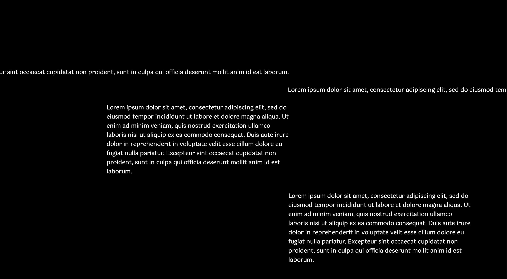

```python
        lorem = "".join("Lorem ipsum dolor sit amet, consectetur adipiscing elit, sed do eiusmod tempor "
                   "incididunt ut labore et dolore magna aliqua. Ut enim ad minim veniam, quis nostrud "
                   "exercitation ullamco laboris nisi ut aliquip ex ea commodo consequat. Duis aute irure "
                   "dolor in reprehenderit in voluptate velit esse cillum dolore eu fugiat nulla pariatur. "
                   "Excepteur sint occaecat cupidatat non proident, sunt in culpa qui officia deserunt mollit "
                   "anim id est laborum.")
        t2 = TextBox(mn_coord(800, 200), alignment='w')
        t2.explain(lorem)
        t3 = TextBox(mn_coord(800, 250))
        t3.explain(lorem)
        t4 = TextBox(mn_coord(800, 300), line_width=mn_scale(500), alignment='w')
        t4.explain(lorem)
        t5 = TextBox(mn_coord(800, 550), line_width=mn_scale(500))
        t5.explain(lorem)
```

_Example:_ `buff_size`
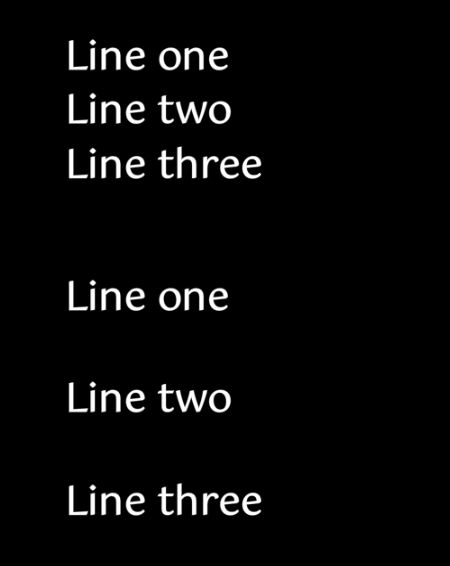

```python
    t1 = TextBox(mn_coord(20, 20))
    t1.explain("Line one")
    t1.explain("Line two")
    t1.explain("Line three")

    t2 = TextBox(mn_coord(20, 120), buff_size= 3 * mn.SMALL_BUFF)
    t2.explain("Line one")
    t2.explain("Line two")
    t2.explain("Line three")

```

## Writing text to a `TextBox`

### Styles

To write text to a textbox, each style listed below can be used as a method. 

> The styles may appear slightly different depending on which operating system you are using.  To modify the chosen fonts, edit the class Fonts in `TextBox.py`

_Example:_ styles
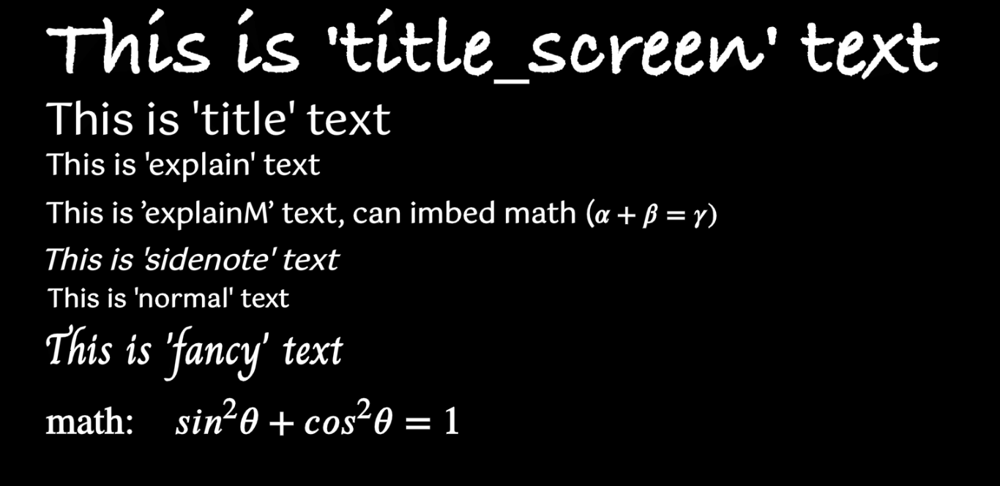

```python
    t1 = TextBox(mn_coord(20, 20))
    
    t1.title_screen("This is 'title_screen' text")
    t1.title("This is 'title' text")
    t1.explain("This is 'explain' text")
    t1.explainM(r"This is 'explainM' text, can imbed math ($\alpha + \beta = \gamma)$")
    t1.sidenote("This is 'sidenote' text")
    t1.normal("This is 'normal' text")
    t1.fancy("This is 'fancy' text")
    t1.math(r"\text{math:}\quad sin^2\theta + cos^2\theta = 1")
```

### Text Property Options

| Option         | Default              | Description                                                  |
| -------------- | -------------------- | ------------------------------------------------------------ |
| `font_size`    | depends on the style | Set the font_size                                            |
| `fill_color`   | WHITE                | The colour of the text                                       |
| `stroke_width` | 0                    | The width of the outline of the text                         |
| `stroke_color` | BLUE                 | The colour of the outline of the text                        |
| `is_axiom`     | FALSE                | if set to `True`, then the colour of the text will automatically be set to the 'axiom' colour (BLUE) |


_Example:_ Changing the font size
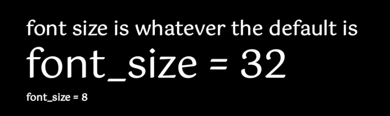

```python
    t1 = TextBox(mn_coord(20, 20))
    t1.explain("font size is whatever the default is")
    t1.explain('font_size = 32', font_size=32)
    t1.explain("font_size = 8", font_size=8)
```

_Example:_ Stroke and Fill Colour
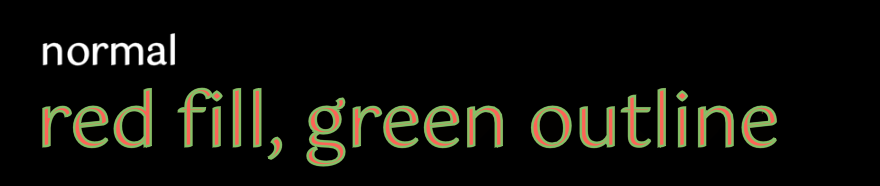

```python
    t1 = TextBox(mn_coord(20, 20))
    t1.explain("normal")
    t1.explain("red fill, green outline", fill_color=RED, stroke_color=GREEN, stroke_width=1, font_size=30)
```


### Styling "*after the fact*"

By default, changing the properties of a `TextBox` will always be animated.

```python
def blue(self,     *index:(int|slice))-> EIndexedGroup|EMObject: ...
def green(self,    *index:(int|slice))-> EIndexedGroup|EMObject: ...
def red(self,      *index:(int|slice))-> EIndexedGroup|EMObject: ...
def white(self,    *index:(int|slice))-> EIndexedGroup|EMObject: ...
def grey(self,     *index:(int|slice))-> EIndexedGroup|EMObject: ...
def e_fade(self,   *index:(int|slice))-> EIndexedGroup|EMObject: ...
def e_normal(self, *index:(int|slice))-> EIndexedGroup|EMObject: ...
def lift(self,     *index:(int|slice))-> EIndexedGroup|EMObject: ...
def notice(self,   *index:(int|slice))-> EIndexedGroup|EMObject: ...
```
_Example:_ Changing the property after creation
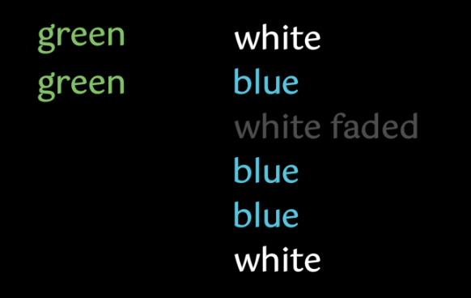

```python
    t1 = TextBox(mn_coord(20, 20))
    t1.explain("green")
    t1.explain("green")
    
    t2 = TextBox(mn_coord(120, 20))
    t2.explain("white")
    t2.explain("blue")
    t2.explain("white faded")
    t2.explain("blue")
    t2.explain("blue")
    t2.explain("white")

    t1.green()                  # change all text elements in TextBox to green
    t2.blue(1,slice(3,5))       # change [1] and [3:5] text elements to blue
    t2.e_fade(2)                # fade 3rd text element

```

### Additional Vertical Spacing

`t1.down` adds an extra blank line

_Example:_ Adding vertical spacing
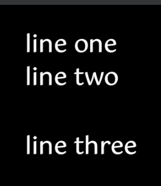

```python
    t1 = TextBox(mn_coord(20, 20))
    t1.explain("line one")
    t1.explain("line two")
    t1.down()				# move down a bit
    t1.down()               # move down a bit
    t1.explain("line three")
```


### Lists

Only bulleted lists, no numbered lists unless you code it manually

_Example:_ bulleted list:
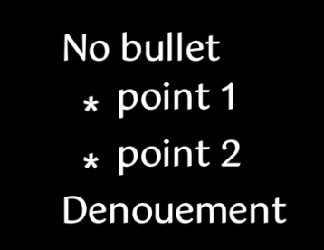

```python
    t1 = TextBox(mn_coord(20, 20))
    t1.explain("No bullet")
    
    t1.set_bullet_symbol("*")
    t1.explain("point 1")
    t1.explain("point 2")
    t1.reset_bullet_symbol()
    
    t1.explain("Denouement")
```


### Text Alignment Options

| name          | type | default         | description |
| ------------- | ---- | --------------- | ----------- |
| `same_line` | `bool` | `False` | put this new text on the same line as the previous |
| `align_index` | `int`,  `Text.EStringObj`| `-1` | the text line object (or `TextBox[index]`) to use as the reference for alignment (does nothing if `align_str` and `transform_from` are both `None`) |
| `align_str` | `mn.SingleSelector`, `tuple[mn.SingleSelector, mn.SingleSelector]` | `None` | What are we aligning to (i.e.  the new string will be placed such that substring `align_str[1]` will line up with reference line substring `align_str[0]`) |
| `transform_from` | `int`,  `Text.EStringObj` | `None` | the text line object (or `TextBox[index]`) to use as the reference for transforming from |
| `transform_args` | `dict` | `None` | |

#### Continue Text on Same Line

`same_line` suppresses the creation of a new line, *however*, with long paragraphs, it will **not** just continue the paragraph the way you might expect.  

> *Suggestion*, just use with math formulas, not with paragraphs

_Example_: Continuing on same line
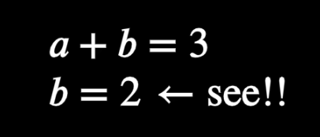

```python
    t1 = TextBox(mn_coord(20, 20))
    t1.math("a + b = 3")
    t1.math("b = 2")
    t1.math(r"\quad \leftarrow \text{see!!}", same_line=True)
```


#### Aligning Math Formulas

_Example:_ Simple alignment by string
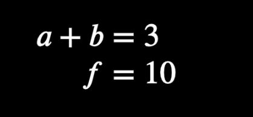

```python
    t1 = TextBox(mn_coord(20, 20))
    t1.math("a + b = 3")
    t1.math("f = 10", align_str="=")
```

_Example:_ Simple alignment, but where aligned strings are different
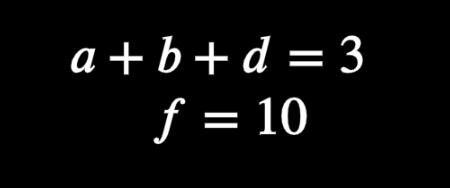

```python
    t1 = TextBox(mn_coord(20, 20))
    t1.math("a + b + d = 3")
    t1.math("f = 10",align_str=("b","f"))
```

_Example:_ Align strings using `align_index`
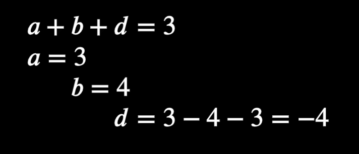

```python
    t1 = TextBox(mn_coord(20, 20))
    
    eq = t1.math("a + b + d = 3")
    
    t1.math("a = 3", align_str="a", align_index=eq)
    t1.math("b = 4", align_str="b", align_index=eq)					# aligned_index=-2 would also work
    t1.math("d = 3 - 4 - 3 = -4", align_str="d", align_index=eq)	# aligned_index=-3 would also work
```


### Text Transformations

Creates a new text, transformed from a copy of the reference text (`transform_from` argument)

#### `transform_arg` arguments

| argument  | type             | default | description                                                  |
| --------- | ---------------- | ------- | ------------------------------------------------------------ |
| `key_map` | `dict:[str:str]` | `None`  | Helps the transformation algorithm *know* which substring from the reference text should be transformed into which sub string in the final text |

_Example_: Simple Transform


```python
    t1 = TextBox(mn_coord(20, 20))
    t1.math(r'a = 2 b',)
    t1.math(r'2 b = a', transform_from=-1)  
```

or

```python
    t1 = TextBox(mn_coord(20, 20))
    eq = t1.math(r'a = 2 b',)
    t1.math(r'2 b = a', transform_from=eq)
```

_Example_: Transformation with `key_map`


```python
    t1 = TextBox(mn_coord(20,20))
    
    t1.explainM(r"transforming $\quad a^2\rightarrow x$, $\quad b^2\rightarrow y$, $\quad c\rightarrow f$")
    t1.math(r'a^2 + b = c')
    t1.math(r'x+y=f', transform_from=-1, transform_args=dict(key_map={'a^2':'x','b':'y','c':'f'}))
    
    t1.down()
    t1.explainM(r"transforming $\quad a^2\rightarrow y$, $\quad b^2\rightarrow x$, $\quad c\rightarrow f$")
    t1.math(r'a^2 + b = c')
    t1.math(r'x+y=f', transform_from=-1, transform_args=dict(key_map={'a^2': 'y', 'b': 'x', 'c': 'f'}))
```


### TextBox - breaking line into parts

If the line is broken into parts via `break_into_parts` option, then each part of the equation can be accessed via the `parts` iterable. Each part is a valid text object!

_Example:_ Simple `break_into_parts`


```python
    t1 = TextBox(mn_coord(20, 20))
    
    eq = t1.math('z=x+y',break_into_parts=['z','=x+y'])
    eq1,eq2 = eq.parts
    
    eq1.red()
    eq2.blue()
```

_Example:_ Aligning text using `break_into_parts`

Where each part is drawn is based on the original string (its not a perfect system, but reasonably so)
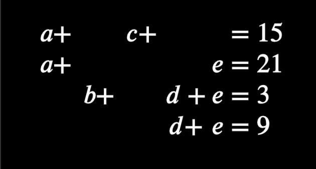

```python
    t1 = TextBox(mn_coord(20, 20))
    t1.math('a+b+c+d+e=15',break_into_parts=['a+','c+','=15'])
    t1.math('a+b+c+d+e=21',break_into_parts=['a+','e','=21'])
    t1.math('a+b+c+d+e=3',break_into_parts=['b+','d+e','=3'])
    t1.math('a+b+c+d+e=9',break_into_parts=['d+','e','=9'])
```


